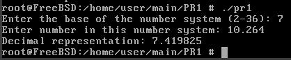

# ЗАВДАННЯ (7 ВАРІАНТ)

## Умова:

Напишіть програму на ANSI C, яка читає з stdin довільне ціле число — основу системи числення, потім ціле число у цій системі числення, а далі виводить його значення у десятковій системі. Ігноруйте всі недопустимі символи.

Приклад:
Вхід:   8 77   
Вихід:  63 (значення 77 у системі числення з основою 8)

Додайте обробку значень із плаваючою точкою для десяткової системи числення.

## [Код до завдання](task_files/task.c)

## Як працює програма:

1. Користувач вводить ціле число (основу системи числення) від 2 до 36. Програма перевіряє, чи значення основи є коректним.

2. Користувач вводить число у вказаній системі числення. Програма обробляє вхідні дані, ігноруючи некоректні символи.

3. Якщо число є цілим (не містить символу `.`), використовується функція `convert_integer`, яка конвертує рядок у десяткове число. Якщо число має дробову частину (містить символ `.`), використовується функція `convert_float`, яка обробляє як цілу, так і дробову частини числа.

4. Програма виводить значення числа у десятковій системі числення.

## Результат роботи:

### Для цілого числа:

### Для числа з плаваючою точкою:

