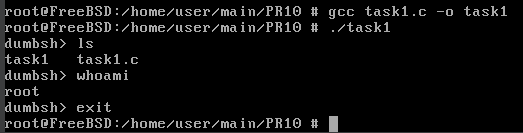
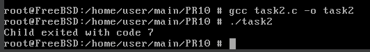
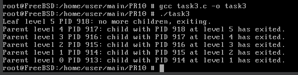

# Завдання 1 (Приклад 2.7 та 2.8)

## Умова

Проєкт: Dumb Shell (DumbSH)
Ціль:
1. Створити просту оболонку, яка запускає команди користувача.
2. Скомпілювати та запустити програму.

## Виконання

### [Код програми](task1/task1.c) 

### Пояснення

Цей код реалізує просту оболонку, яка в циклі зчитує команду користувача, виводячи запрошення `dumbsh>`. Якщо введено `exit`, програма завершується. Інакше створюється новий процес за допомогою `fork()`. У дочірньому процесі виконується введена команда за допомогою `execlp()`, а в разі помилки виводиться повідомлення. Батьківський процес чекає завершення дочірнього через `wait()`. Таким чином, кожна команда виконується в окремому процесі, і після її завершення оболонка знову чекає на нову команду.

### Результат запуску програми



# Завдання 2 (Приклад 2.9 API wait — деталі)

## Умова

- wait() — чекає на будь-який дочірній процес.
- waitpid(pid, ...) — чекає на конкретний PID.
- WNOHANG — не блокує, якщо дитина ще не завершилась.


## Виконання

### [Код програми](task2/task2.c) 

### Пояснення

Цей код створює дочірній процес за допомогою `fork()`. У дочірньому процесі виконується `_exit(7)`, тобто він завершується з кодом 7. Батьківський процес чекає завершення дитини за допомогою `waitpid()`, після чого перевіряє, чи дитина завершилася нормально (`WIFEXITED`) і виводить код її завершення через `WEXITSTATUS`. У результаті програма виведе:
```bush
Child exited with code 7
```

### Результат запуску програми



# Завдання 3 (7 варіант)

## Умова

Реалізуйте послідовне породження процесів, де кожен створений процес створює ще один дочірній, усього п’ять разів. Прослідкуйте порядок завершення.

## Виконання

### [Код програми](task3/task3.c) 

### Пояснення

Змінна `level` відображає глибину вкладеності: 
- 0 — оригінальний процес 
- 1 — його син і т.д. 

До тих пір, поки `level < MAX_LEVEL` (в даному випадку `MAX_LEVEL = 5`), ми виконуємо `fork()`. Якщо `fork()` повернув 0, то ми всередині дочірнього, тоді збільшуємо `level` і повертаємося в цикл, щоб ця дитина породила ще одного. Якщо ж `fork()` повернув `PID > 0`, то це батьківський процес на поточному рівні `level`. Він одразу ж виконує `waitpid(pid, &status, 0);` та чекає завершення свого
безпосереднього сина, який працює на рівні `level + 1`. Як тільки цей син завершується, батько виводить рядок виду
```bush
Parent level %d PID %d: child with PID %d at level %d has exited.
```
і викликає `exit(0)`, тобто завершується. Це гарантує, що на кожному рівні базовий процес не продовжує просто так виконуватися далі.

Коли ж дочірній досягне `level == MAX_LEVEL` (тобто 5), він не заходить у цю гілку `if (pid > 0) { … exit(0); }`, а виходить із циклу, доходить до кінця `main` і просто виводить:
```bush
Leaf level %d PID %d: no more children, exiting.
```
Потім спить секунду, щоб було помітно, що саме він найперший завершується, і повертає 0. Після цього повернеться в батьківський процес (рівня 4), який тільки-но виконав свій `waitpid()`. Таким чином, спочатку завершується процес на рівні 5 (найглибший), потім батько 4 рівня виводить повідомлення і виходить, потім його батько на рівні 3 і т.д., аж до батьківського на рівні 0.

### Результат запуску програми


