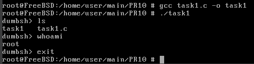
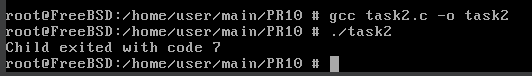
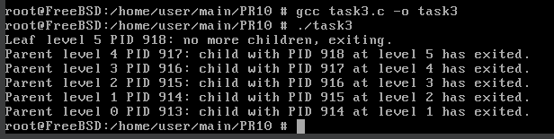

# Завдання 1 (Приклад 2.7 та 2.8)

## Умова

Проєкт: Dumb Shell (DumbSH)
Ціль:
1. Створити просту оболонку, яка запускає команди користувача.
2. Скомпілювати та запустити програму.

## Виконання

### [Код програми](task1/task1.c) 

### Пояснення

Цей код реалізує просту оболонку, яка в циклі зчитує команду користувача, виводячи запрошення `dumbsh>`. Якщо введено `exit`, програма завершується. Інакше створюється новий процес за допомогою `fork()`. У дочірньому процесі виконується введена команда за допомогою `execlp()`, а в разі помилки виводиться повідомлення. Батьківський процес чекає завершення дочірнього через `wait()`. Таким чином, кожна команда виконується в окремому процесі, і після її завершення оболонка знову чекає на нову команду.

### Результат запуску програми

# Завдання 2 (Приклад 2.9 API wait — деталі)

## Умова

- wait() — чекає на будь-який дочірній процес.
- waitpid(pid, ...) — чекає на конкретний PID.
- WNOHANG — не блокує, якщо дитина ще не завершилась.

## Виконання

### [Код програми](task2/task2.c) 

### Пояснення

Цей код створює дочірній процес за допомогою `fork()`. У дочірньому процесі виконується `_exit(7)`, тобто він завершується з кодом 7. Батьківський процес чекає завершення дитини за допомогою `waitpid()`, після чого перевіряє, чи дитина завершилася нормально (`WIFEXITED`) і виводить код її завершення через `WEXITSTATUS`. У результаті програма виведе 
>Child exited with code 7

### Результат запуску програми

# Завдання 3

## Умова

Бібліотечна функція qsort призначена для сортування даних будь-якого типу. Для її роботи необхідно підготувати функцію порівняння, яка викликається з qsort кожного разу, коли потрібно порівняти два значення.
Оскільки значення можуть мати будь-який тип, у функцію порівняння передаються два вказівники типу void* на елементи, що порівнюються.

- Напишіть програму, яка досліджує, які вхідні дані є найгіршими для алгоритму швидкого сортування. Спробуйте знайти кілька масивів даних, які змушують qsort працювати якнайповільніше. Автоматизуйте процес експериментування так, щоб підбір і аналіз вхідних даних виконувалися самостійно.

- Придумайте і реалізуйте набір тестів для перевірки правильності функції qsort.

## Виконання

### [Код програми](task3/task3.c) 

### Пояснення

Функція `qsort` у стандартній бібліотеці C реалізує алгоритм швидкого сортування, який зазвичай працює за час приблизно O(n log n). Однак у найгіршому випадку, коли вибір опорного елемента неефективний (наприклад, якщо масив вже відсортований або відсортований у зворотному порядку і опорним вибирається крайній елемент), час роботи може зрости до квадратичного — O(n²). Тому, щоб дослідити найгірші вхідні дані для `qsort`, у програмі створюються різні типи масивів: впорядкований за зростанням, впорядкований у зворотному напрямку, масив із однаковими елементами, масив із циклічно повторюваним патерном та випадковий масив. Для кожного такого масиву виконується сортування за допомогою `qsort`, після чого вимірюється час роботи функції та перевіряється, чи масив дійсно відсортований. Функція `compare` порівнює два цілі числа, передані як вказівники `void*`, що є типовим підходом для універсальної функції порівняння, необхідної для `qsort`.

Під час тестування визначається, який тип вхідних даних призводить до найтривалішого часу роботи `qsort`, що фактично є найгіршим випадком. Найчастіше це буває вже відсортований масив або масив, відсортований у зворотному напрямку, залежно від реалізації функції. Масив із однаковими елементами також може бути проблемним, якщо реалізація не оптимізована на обробку таких випадків.

Автоматизація полягає у тому, що для кожного типу вхідних даних виділяється пам'ять під масив, він заповнюється відповідними значеннями, запускається сортування, фіксується час роботи, а потім перевіряється коректність сортування. Результати виводяться на екран для наочного порівняння. Завдяки цьому можна не лише виявити найгірші випадки, а й перевірити правильність роботи функції `qsort` на різних вхідних даних.

Таким чином, цей підхід дозволяє як виявити типи вхідних даних, які найгірше впливають на швидкість сортування, так і автоматично тестувати правильність роботи функції сортування у різних сценаріях, що робить програму універсальним інструментом для аналізу та перевірки функції `qsort`.

### Результат запуску програми

