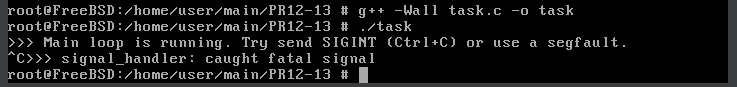

# ЗАВДАННЯ (7 ВАРІАНТ)

## Умова:

Реалізуйте сигналобезпечну функцію обробки помилки, яка намагається коректно завершити роботу з усіма ресурсами, включаючи сокети, тимчасові файли та потокові буфери.

## [Код до завдання](task_files/task.cpp)

## Пояснення

Ця програма написана на C++ для сигналобезпечної обробки помилки. У разі критичного сигналу, як-от `SIGINT` (Ctrl+C), `SIGSEGV`, `SIGTERM` тощо, вона коректно звільняє ресурси, закриваючи відкриті сокети, видаляючи тимчасові файли та завершуючи роботу без витоків. На початку програми створюються глобальні масиви для зберігання списку відкритих сокетів та шляхів до тимчасових файлів. Це зроблено з розрахунком на те, що всередині обробника сигналу не можна використовувати динамічну пам’ять або об'єкти з STL, тому вся реєстрація ресурсів проводиться заздалегідь. Реєстрація відбувається через функції `register_socket` та `register_tmpfile`, які просто додають дескриптор або шлях до відповідного масиву, якщо не перевищено ліміт. Далі програма налаштовує обробку сигналів за допомогою `sigaction`, вказуючи власну функцію-обробник `signal_handler`, яка приймає розширені параметри, такі як номер сигналу, інформацію про сигнал, та контекст виконання. Цей обробник прописується для кількох сигналів, зокрема `SIGINT`, `SIGTERM`, `SIGSEGV`, `SIGFPE`, `SIGBUS`. У самій функції `signal_handler` програма викликає `write` — це сигналобезпечна функція, яка дозволяє вивести повідомлення до стандартного потоку помилок (`stderr`) про те, що було отримано сигнал. Потім перебирається масив сокетів і всі відкриті дескриптори закриваються через `close`. Після цього програма видаляє всі тимчасові файли через `unlink`, використовуючи збережені шляхи. Завершення роботи відбувається викликом `_exit`, оскільки `exit` викликає небезпечні дії, наприклад виконання `atexit`-обробників, які можуть використовувати небезпечні функції типу `malloc`, `printf` чи `fclose`. У `main` функції після налаштування обробки сигналів викликається функція створення тимчасового файлу `create_and_register_tmpfile`, яка через `mkstemp` створює унікальний файл у `/tmp` і додає його шлях до масиву для подальшого видалення. Так само створюється TCP-сокет через `socket`, і його дескриптор реєструється для закриття. Далі програма виводить у стандартний потік повідомлення про запуск основного циклу, після чого переходить у нескінченний цикл з `pause`, який призупиняє виконання процесу до отримання сигналу. Коли надходить сигнал, наприклад при натисканні Ctrl+C, програма переходить у обробник `signal_handler`, виконує прибирання — закриває зареєстровані сокети, видаляє тимчасові файли, виводить повідомлення і завершується. Завдяки такому підходу вдається уникнути залишків ресурсів у системі, зокрема невидалених файлів або відкритих сокетів, що є критично важливим для стабільної та безпечної роботи системних програм і серверів.

## Результат роботи:

