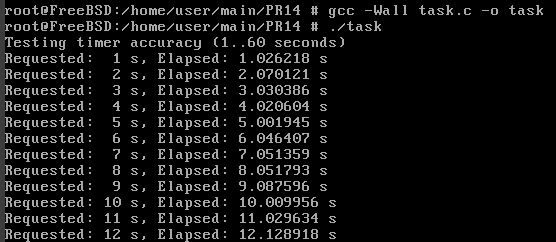
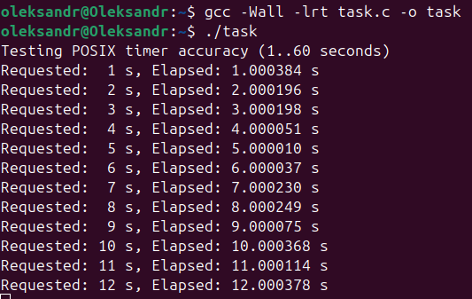

# ЗАВДАННЯ (7 ВАРІАНТ)

## Умова:

Напишіть тест, який перевіряє точність POSIX-таймера на великих інтервалах (від 1 до 60 секунд).

## [Код до завдання (1 версія на FreeBSD)](task_files/task_freebsd.c)

## [Код до завдання (2 версія на Linux Ubuntu)](task_files/task_linux.c)

## Пояснення

Перша програма для FreeBSD тестує точність системного таймера на великих інтервалах (1–60 секунд). Вона використовує `setitimer()` для запуску таймера, який надсилає сигнал `SIGALRM` через заданий час. Програма фіксує час до й після спрацювання таймера за допомогою `clock_gettime()` з годинником `CLOCK_MONOTONIC`, щоб точно виміряти затримку. Сигнал `SIGALRM` обробляється функцією, яка встановлює прапорець, що дозволяє продовжити виконання. Таким чином, для кожного інтервалу програма виводить очікуваний і фактичний час затримки.

`POSIX`-таймери (`timer_create`, `timer_settime`) у FreeBSD не використовуються, оскільки система не підтримує їх у стандартній бібліотеці — при компіляції виникає помилка "`undefined reference`". Через це замість `POSIX API` використано класичний `Unix`-таймер.

У версії для Linux використовується повноцінний `POSIX`-таймер. в ній створюється окремий таймер через `timer_create()`, який надсилає сигнал `SIGRTMIN`, і програма очікує цей сигнал через `sigwaitinfo()`. Це дозволяє використовувати більш точний таймер і мати кілька незалежних таймерів одночасно. На відміну від FreeBSD, Linux підтримує ці функції без додаткових бібліотек або розширень.

Отже, обидві програми виконують одне й те саме завдання, але використовують різні таймери через технічні обмеження операційної системи. Linux-варіант точніший і відповідає стандарту `POSIX`, а FreeBSD-варіант реалізований через доступні системні засоби.

## Результат роботи:

### FreeBSD (Unix-timer):

### Linux Ubuntu (POSIX-timer):

