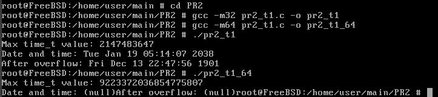
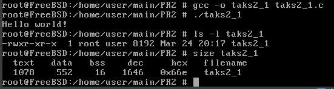
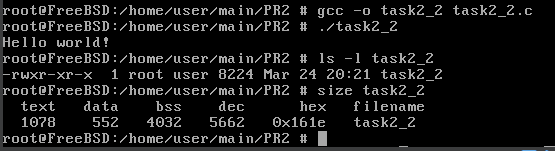
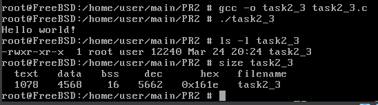
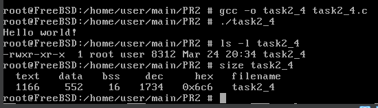
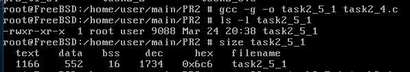
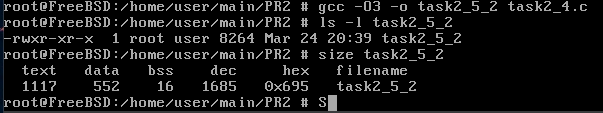
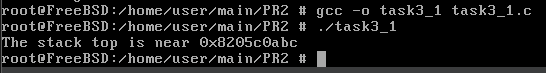
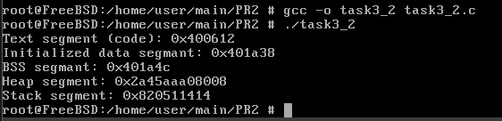
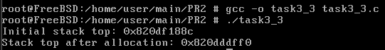

# ЗАВДАННЯ 1:

## Умова:

Напишіть програму для визначення моменту, коли time_t закінчиться.Дослідіть, які зміни відбуваються в залежності від 32- та 64-бітної архітектури. Дослідіть сегменти виконуваного файлу.

## Код задачі:

```c
#include <stdio.h>
#include <time. h>
#include <limits.h>

int main() {
    time_t max_time = (time_t)~((time_t)1 << (sizeof (time_t) * 8 - 1));
    printf ("Max time_t value: %ld\n", (long)max_time);
    printf ("Date and time: %s", ctime(&max_time));

    time_t overf low_time = max_time + 1;
    printf ("After overf low: %s", ctime(&overflow_time) );

    return 0;
}
```

## Пояснення програми:

Програма визначає максимальне значення типу `time_t`, що залежить від розрядності архітектури (32-біт або 64-біт). На 32-бітній архітектурі значення переповниться після 19 січня 2038 року (проблема 2038 року). На 64-бітній архітектурі обмеження значно більше, і значення time_t покриває мільярди років. При переповненні `time_t` результати роботи функцій, таких як `ctime`, можуть стати некоректними.

## Результат роботи:




# ЗАВДАННЯ 2:

## Умова:

Розгляньте сегменти у виконуваному файлі.

1. Скомпілюйте програму &quot;hello world&quot;, запустіть ls -l для виконуваного файлу, щоб отримати його загальний розмір, і запустіть size, щоб отримати розміри сегментів всередині нього.
2. Додайте оголошення глобального масиву із 1000 int, перекомпілюйте й повторіть вимірювання. Зверніть увагу на відмінності.
3. Тепер додайте початкове значення в оголошення масиву (пам’ятайте, що C не змушує вас вказувати значення для кожного елемента масиву в ініціалізаторі). Це перемістить масив із сегмента BSS у сегмент даних. Повторіть вимірювання. Зверніть увагу на різницю.
4. Тепер додайте оголошення великого масиву в локальну функцію. Оголосіть другий великий локальний масив з ініціалізатором. Повторіть вимірювання. Дані розташовуються всередині функцій, залишаючись у виконуваному файлі? Яка різниця, якщо масив ініціалізований чи ні?
5. Які зміни відбуваються з розмірами файлів і сегментів, якщо ви компілюєте для налагодження? Для максимальної оптимізації?

Проаналізуйте результати, щоб переконатися, що:
● сегмент даних зберігається у виконуваному файлі;
● сегмент BSS не зберігається у виконуваному файлі (за винятком примітки щодо його вимог до розміру часу виконання);
● текстовий сегмент більшою мірою піддається перевіркам оптимізації;
● на розмір файлу a.out впливає компіляція для налагодження, але не сегменти.

## Код задачі:

```c
#include <stdio.h>

int main() {
    printf ("Hello world!\n");
    return 0:
}
```

## Пояснення програми:

Це проста програма, яка демонструє розміри базового виконуваного файлу. Виконуваний файл містить тільки текстовий сегмент із кодом програми.

## Результат роботи:



## Код задачі:

```c
#include <stdio.h>

int arr[1000];

int main() {
    printf ("Hello world!\n");
    return 0:
}
```

## Пояснення програми:

Глобальний масив додається до сегмента BSS, який не зберігається у виконуваному файлі, але резервується під час виконання. Розмір виконуваного файлу незначно змінюється, однак обсяг пам’яті, необхідний для виконання програми, збільшується.

## Результат роботи:



## Код задачі:

```c
#include <stdio.h>

int arr[1000] = {1};

int main() {
    printf ("Hello world!\n");
    return 0:
}
```

## Пояснення програми:

Глобальний масив із початковим значенням переміщається з сегмента BSS до сегмента DATA. Це впливає на розмір виконуваного файлу, оскільки сегмент DATA зберігається у ньому.

## Результат роботи:



## Код задачі:

```c
#include <stdio.h>
void func() {
    int arr1[1000];
    int arr2[1000] = {1};
}
  
int main() {
    printf ("Hello world!\n");
    return 0:
}
```

## Пояснення програми:

Локальні масиви створюються в стеку під час виконання програми. Масив без ініціалізації `arr1` розміщується в стеку, а масив із ініціалізацією `arr2` додає додаткові дані до текстового сегмента. Виконуваний файл змінюється лише через наявність ініціалізованого масиву.

## Результат роботи:



## Код задачі:

```c
#include <stdio.h>
void func() {
    int arr1[1000];
    int arr2[1000] = {1};
}
  
int main() {
    printf ("Hello world!\n");
    return 0:
}
```

## Пояснення програми:

При компіляції з налагодженням файл містить додаткову інформацію для дебагу, що збільшує його розмір. Максимальна оптимізація зменшує розмір текстового сегмента, але не впливає на сегменти DATA і BSS. Масиви в стеку залишаються лише під час виконання програми, не змінюючи розміри виконуваного файлу.

## Результат роботи:






# ЗАВДАННЯ 3:

## Умова:

Скомпілюйте й запустіть тестову програму, щоб визначити приблизне розташування стека у вашій системі:
```c
#include <stdio.h>

int main() {
        int i;
        printf(&quot;The stack top is near %p\n&quot;, &amp;i);
        return 0;
}
```
Знайдіть розташування сегментів даних і тексту, а також купи всередині сегмента даних, оголосіть змінні, які будуть поміщені в ці сегменти, і виведіть їхні адреси. Збільшіть розмір стека, викликавши функцію й оголосивши кілька великих локальних масивів. Яка зараз адреса вершини стека?

*Примітка*: стек може розташовуватися за різними адресами на різних архітектурах та різних ОС. Хоча ми говоримо про вершину стека, на більшості процесорів стек зростає вниз, до пам’яті з меншими значеннями адрес.

## Код задачі:

```c
#include <stdio.h>

int main() {
        int i;
        printf(&quot;The stack top is near %p\n&quot;, &amp;i);
        return 0;
}
```

## Результат роботи:



## Код задачі:

```c
#include <stdio.h>
#include <stdlib.h>

int x = 1;
int y;

void func() {
    int z;
    int *heap = malloc(sizeof (int));

    printf ("Text segment (code): %p\n", (void*)func);
    printf ("Initialized data segmant: %p\n", (void*)&x);
    printf ("BSS segmant: %p\n", (void*)&y);
    printf ("Heap segment: %p\n", (void*)heap);
    printf ("Stack segment: %p\n", (void*) &z);

    free (heap);
}

int main() {
    func();
    return 0;
}
```

## Пояснення програми:

Виводяться адреси змінних, розташованих у різних сегментах пам’яті:
    1. Text (код): Адреса функції `func` вказує на текстовий сегмент (зберігає машинний код програми).
    2. Initialized data (DATA): Змінна `x` — глобальна змінна з ініціалізацією.
    3. BSS: Змінна `y` — глобальна змінна без ініціалізації.
    4. Heap (купа): Виділення пам’яті через malloc демонструє розташування купи.
    5. Stack (стек): Адреса локальної змінної `z` демонструє розташування стека.
Програма дозволяє порівняти розташування різних сегментів у пам’яті.

## Результат роботи:



## Код задачі:

```c
#include <stdio.h>

void func() {
    int arr1[10000];
    int arr2[10000];
    printf ("Stack top after allocation: %p\n", &arr2);
}

int main() {
    int i;
    printf ("Initial stack top: %p\n", &i);
    func();
    return 0;
}
```

## Пояснення програми:

У коді досліджується, як змінюється розташування вершини стека при виділенні великих локальних масивів. На початку виводиться адреса змінної `i` у `main`, що вказує на початкове розташування стека. Після виклику функції func, де оголошені масиви `arr1` і `arr2`, адреса вершини стека зсувається вниз (у більшість архітектур стек зростає до нижчих адрес). Це ілюструє динамічний характер використання стека під час виконання програми.

## Результат роботи:


