# ЗАВДАННЯ 1:

## Умова:

Запустіть Docker-контейнер і поекспериментуйте з максимальним лімітом ресурсів відкритих файлів. Для цього виконайте команди у вказаному порядку:

$ ulimit -n

$ ulimit -aS | grep "open files"

$ ulimit -aH | grep "open files"

$ ulimit -n 3000

$ ulimit -aS | grep "open files"

$ ulimit -aH | grep "open files"

$ ulimit -n 3001

$ ulimit -n 2000

$ ulimit -n

$ ulimit -aS | grep "open files"

$ ulimit -aH | grep "open files"

$ ulimit -n 3000

Як наступне вправу, повторіть перераховані команди з root-правами.

## Код задачі:

```bash
$ ulimit -n

$ ulimit -aS | grep "open files"

$ ulimit -aH | grep "open files"

$ ulimit -n 3000

$ ulimit -aS | grep "open files"

$ ulimit -aH | grep "open files"

$ ulimit -n 3001

$ ulimit -n 2000

$ ulimit -n

$ ulimit -aS | grep "open files"

$ ulimit -aH | grep "open files"

$ ulimit -n 3000
```

## Виконання:

Для виконання цього завдання було встановлено Ubuntu Server з Docker-ом на Virtual Box. Далі запускаємо контейнер і вводимо команди з умови:

```bash
docker run -it --rm ubuntu bash
```

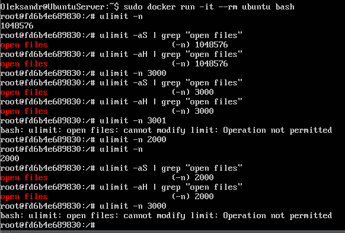

Як результат отримуємо, що змінювати ліміти ми можемо лише вниз. Для підвищення не вистачає прав.

Після цього виходимо з контейнера та запускаємо його повторно, але з параметром `--privileged`, щоб отримати root-права.

```bash
docker run -it --rm --privileged ubuntu bash
```

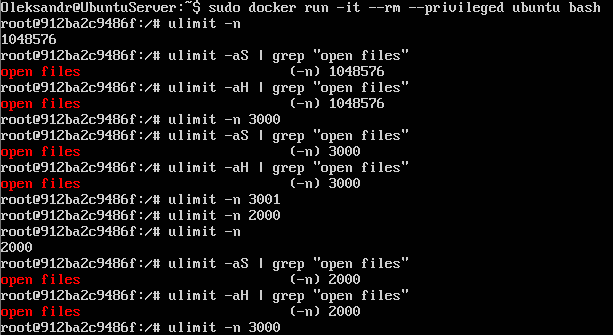

І як результат, за допомогою root-прав можемо як понижувати так і підвищувати ліміти.


# ЗАВДАННЯ 2:

## Умова:

У Docker-контейнері встановіть утиліту `perf(1)`. Поекспериментуйте з досягненням процесом встановленого ліміту.

## Виконання:

Для початку запускаємо контейнер та встановлюємо `perf` за допомогою 
```bash
apt update && apt install -y linux-tools-common linux-tools-generic linux-tools-$(uname -r)
```

Після цього перевіряємо встановлення `perf` за допомогою `perf --version` та встановлюємо ліміт на кількість запущених процесів:

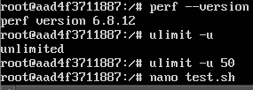


**Примітка:** 

*Пізніше, дослідницьким шляхом, було з'ясвоно, що встановлення лімітів за допомогою команди `ulimit -u` впливає на кількість запущених процесів користувачем, а не системою загалом, тож дана команда виявиться марною.*

Далі за допомогою команди `nano test.sh` створюємо та редагуємо скрипт:

```sh
#!/bin/bash

counter=0
while true; do
  sleep 2 &
  counter=$((counter + 1))
  echo "Created $counter processes'

done
```

Після збереження файлу, запускаємо його за допомогою `nohup ./test.sh &`. `./test.sh` запускає сам скрипт, `&` - робить запуск фоновим, а `nohup` ігнорує ввід та перенаправляє вивід скрипта у файл `nohup.out` замість виводу в `bash`.

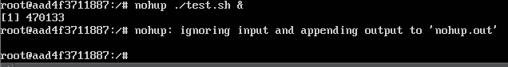

Після цього запускаємо
```bash
perf top -p $(pgrep -d',' -f test.sh)
```
для того, щоб побачити скільки ресурсів займає скрипт `test.sh`. `perf top` відображає всі активні процес та скільки ресурсів займає кожен з них наживо, `-p` фільтрує вивід за конкретним процесом, а `pgrep -d',' -f test.sh` знаходить всі процеси, що мають `test.sh` в імені та виводить їх PID.

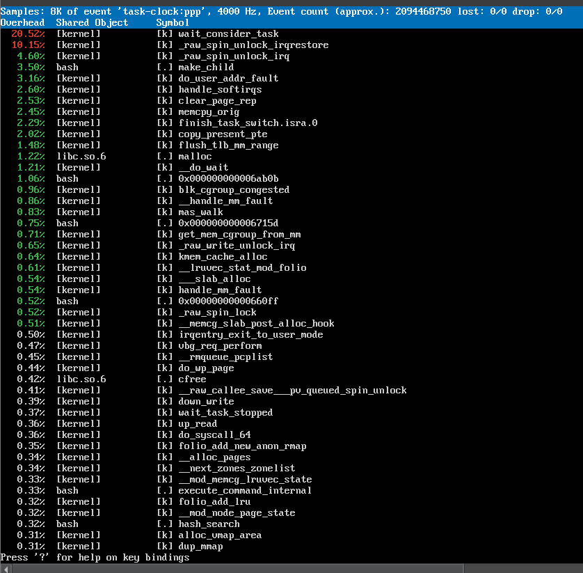

Додатково можна запустити

```bash
ps aux | grep test.sh
```

щоб побачити процеси, які відповідають `test.sh` та їх PID.

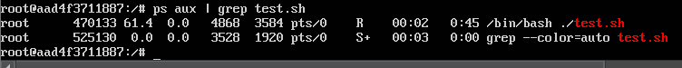


# ЗАВДАННЯ 3:

## Умова:

Напишіть програму, що імітує кидання шестигранного кубика. Імітуйте кидки, результати записуйте у файл, для якого попередньо встановлено обмеження на його максимальний розмір (max file size). Коректно обробіть ситуацію перевищення ліміту.

## Код програми:

```c
#include <stdio.h>
#include <stdlib.h>
#include <time.h>
#include <unistd.h>
#include <sys/stat.h>
#include <string.h>

#define MAX_FILE_SIZE 128
#define FILE_NAME "dice_results.txt"

int check_file_size(const char *file_name, size_t max_size) {
    struct stat st;
    if (stat(file_name, &st) == 0) {
        return (st.st_size > max_size);
    }
    return 0;
}

void clear_file(const char *file_name) {
    FILE *file = fopen(file_name, "w");
    if (file != NULL) {
        fclose(file);
        printf("File cleared successfully.\n");
    } else {
        perror("Error clearing file");
    }
}

int main() {
    FILE *file;
    int roll;
    srand(time(NULL));

    file = fopen(FILE_NAME, "a");
    if (file == NULL) {
        perror("Error opening file");
        return EXIT_FAILURE;
    }

    printf("Starting dice simulation. Press Ctrl+C to stop.\n");

    while (1) {
        if (check_file_size(FILE_NAME, MAX_FILE_SIZE)) {
            printf("File size exceeded %d bytes.\n", MAX_FILE_SIZE);
            printf("Do you want to clear the file? (y/n): ");

            char response[10];
            fgets(response, sizeof(response), stdin);

            if (strncmp(response, "y", 1) == 0 || strncmp(response, "Y", 1) == 0) {
                clear_file(FILE_NAME);
                file = freopen(FILE_NAME, "a", file);
                if (file == NULL) {
                    perror("Error reopening file");
                    return EXIT_FAILURE;
                }
            } else {
                printf("Exiting simulation.\n");
                break;
            }
        }

        roll = (rand() % 6) + 1;

        printf("Rolling: %d\n", roll);
        fprintf(file, "Rolling: %d\n", roll);
        fflush(file);

        usleep(100000);  // 100 мс
    }

    fclose(file);
    printf("Simulation finished.\n");
    return EXIT_SUCCESS;
}

```

## Виконання:

Для початку запустимо контейнер та встановимо `gcc` та `nano` за допомогою команд
```bash
apt update 
apt install gcc && apt install nano
```

та перевіримо встановлення за допомогою `--version`

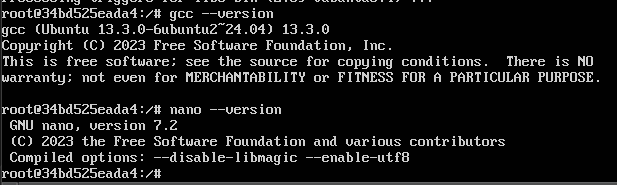

Далі скомпілюємо та запустимо програму. Після запуску програма починає імітувати кидання кубика та записувати дані у файл `results.txt` поки користувач не зупинить програму за допомогою Ctrl + C або поки файл не заповниться. Якщо файл заповниться буде запропоновано очистити його або зупинити програму.

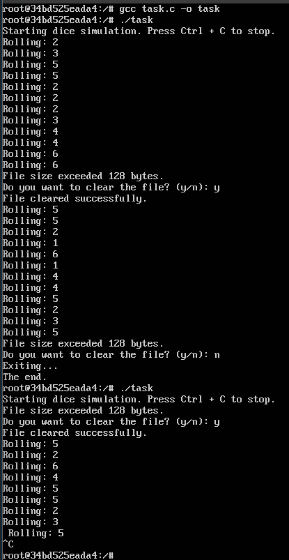

Можемо також переглянути вміст файлу `results.txt` за допомогою команди `cat results.txt`

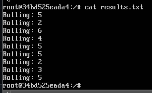

та перевірити розмір файлу за допомогою `ls -lh results.txt` 

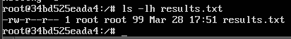

**Примітка:**
*"Rolling:" займає 8 байтів, пробіл після двокрапки та цифра займають 2 байти і ще один байт займає символ нового рядка. В результаті 99 байтів займає файл (11 байтів на рядок і 9 рядків).*


# ЗАВДАННЯ 4:

## Умова:

Напишіть програму, що імітує лотерею, вибираючи 7 різних цілих чисел у діапазоні від 1 до 49 і ще 6 з 36. Встановіть обмеження на час ЦП (max CPU time) і генеруйте результати вибору чисел (7 із 49, 6 із 36). Обробіть ситуацію, коли ліміт ресурсу вичерпано.

## Код програми:

```c
#include <stdio.h>
#include <stdlib.h>
#include <time.h>
#include <sys/time.h>
#include <sys/resource.h>
#include <unistd.h>

#define NUM1 7
#define MAX1 49

#define NUM2 6
#define MAX2 36

void select_random_numbers(int *numbers, int max, int count) {
    for (int i = 0; i < max; i++) {
        numbers[i] = i + 1;
    }
    for (int i = max - 1; i > 0; i--) {
        int j = rand() % (i + 1);
        int temp = numbers[i];
        numbers[i] = numbers[j];
        numbers[j] = temp;
    }
}

void print_numbers(int *numbers, int count) {
    for (int i = 0; i < count; i++) {
        printf("%d ", numbers[i]);
    }
    printf("\n");
}

int main() {
    struct rlimit rl;
    rl.rlim_cur = 2;  // Ліміт на час ЦП (2 секунди)
    rl.rlim_max = 2;  // Максимальний ліміт часу ЦП
    if (setrlimit(RLIMIT_CPU, &rl) != 0) {
        perror("Error setting CPU time limit");
        return EXIT_FAILURE;
    }

    srand(time(NULL));

    int numbers_49[MAX_49];
    select_random_numbers(numbers_49, MAX_49, NUM_49);
    printf("Lottery numbers (7 out of 49): ");
    print_numbers(numbers_49, NUM_49);

    int numbers_36[MAX_36];
    select_random_numbers(numbers_36, MAX_36, NUM_36);
    printf("Lottery numbers (6 out of 36): ");
    print_numbers(numbers_36, NUM_36);

    printf("Lottery generation completed successfully.\n");

    return EXIT_SUCCESS;
}
```

## Виконня:

Для початку запустимо docker та встановимо `gcc` та `nano` для написання програми, яка імітує лотерею, вибираючи випадкові числа у двох наборах: 7 чисел із діапазону від 1 до 49 і 6 чисел із діапазону від 1 до 36. Для цього використовується алгоритм перемішування масиву чисел, з якого беруться перші N елементів (де N – кількість необхідних чисел). Генерація чисел здійснюється за допомогою вбудованого генератора випадкових чисел, ініціалізованого поточним часом. Перед початком роботи програми встановлюється ліміт часу використання процесора за допомогою функції `setrlimit` із параметром `RLIMIT_CPU`. У цьому коді максимальний ліміт часу процесора встановлений на 2 секунди. Якщо програма перевищує цей ліміт, система автоматично завершує її виконання. Спочатку програма генерує 7 чисел із діапазону 1–49, потім 6 чисел із діапазону 1–36. Результати кожного набору чисел виводяться на екран. Якщо програма завершує свою роботу без перевищення ліміту процесора, користувач бачить повідомлення про успішне завершення генерації лотереї. У разі перевищення ліміту програма примусово завершується операційною системою, і користувач отримає системне повідомлення про завершення.

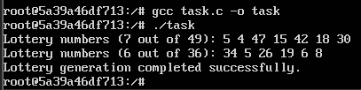


# ЗАВДАННЯ 5:

## Умова:

Напишіть програму для копіювання одного іменованого файлу в інший. Імена файлів передаються у вигляді аргументів.
Програма має:
- перевіряти, чи передано два аргументи, інакше виводити "Program need two arguments";

- перевіряти доступність першого файлу для читання, інакше виводити "Cannot open file .... for reading";

- перевіряти доступність другого файлу для запису, інакше виводити "Cannot open file .... for writing";

- обробляти ситуацію перевищення обмеження на розмір файлу.


## Код програми:

```c
#include <stdio.h>
#include <stdlib.h>

#define BUFFER_SIZE 1024
#define MAX_FILE_SIZE 1048576

int main(int argc, char *argv[]) {
    if (argc != 3) {
        printf("Program need two arguments\n");
        return EXIT_FAILURE;
    }

    const char *source_file = argv[1];
    const char *destination_file = argv[2];

    FILE *source = fopen(source_file, "rb");
    if (source == NULL) {
        printf("Cannot open file %s for reading\n", source_file);
        return EXIT_FAILURE;
    }

    FILE *destination = fopen(destination_file, "wb");
    if (destination == NULL) {
        fclose(source);
        printf("Cannot open file %s for writing\n", destination_file);
        return EXIT_FAILURE;
    }

    char buffer[BUFFER_SIZE];
    size_t bytes_read;
    size_t total_written = 0;

    while ((bytes_read = fread(buffer, 1, BUFFER_SIZE, source)) > 0) {
        if (total_written + bytes_read > MAX_FILE_SIZE) {
            printf("Error: File size limit exceeded while writing to %s\n", destination_file);
            fclose(source);
            fclose(destination);
            return EXIT_FAILURE;
        }

        size_t bytes_written = fwrite(buffer, 1, bytes_read, destination);
        if (bytes_written != bytes_read) {
            printf("Error writing to file %s\n", destination_file);
            fclose(source);
            fclose(destination);
            return EXIT_FAILURE;
        }

        total_written += bytes_written;
    }

    fclose(source);
    fclose(destination);

    printf("File successfully copied from %s to %s\n", source_file, destination_file);
    return EXIT_SUCCESS;
}
```

## Виконня:

Програма приймає два аргументи: ім'я вхідного файлу (джерела) і ім'я вихідного файлу (призначення). Якщо кількість аргументів неправильна, програма завершує роботу з повідомленням: "Program need two arguments". Спочатку програма намагається відкрити вхідний файл для читання. Якщо файл недоступний, вона виводить повідомлення: "Cannot open file [ім'я_файлу] for reading" і завершує роботу. Потім вона намагається відкрити вихідний файл для запису. Якщо файл неможливо відкрити для запису, програма виводить повідомлення: "Cannot open file [ім'я_файлу] for writing" і також завершує роботу. Далі починається процес копіювання. Дані зчитуються з вхідного файлу блоками фіксованого розміру (1024 байти) і записуються у вихідний файл. Під час кожного запису програма перевіряє, чи не перевищено встановлений ліміт розміру файлу (1 MB). Якщо загальний розмір вихідного файлу перевищує цей ліміт, програма виводить повідомлення: "Error: File size limit exceeded while writing to [ім'я_файлу]" і завершує роботу. Якщо весь процес копіювання завершується успішно, програма виводить повідомлення: "File successfully copied from [вхідний_файл] to [вихідний_файл]".

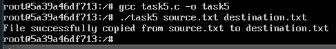

Вміст файлі `source.txt` та `destination.txt`:

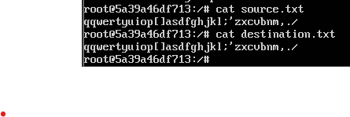


# ЗАВДАННЯ 6:

## Умова:

Напишіть програму, що демонструє використання обмеження (`max stack segment size`). Підказка: рекурсивна програма активно використовує стек.

## Код програми:

```c
#include <stdio.h>
#include <stdlib.h>

void recursive_func(int depth) {
    printf("Recursion depth: %d\n", depth);
    recursive_func(depth + 1);
}

int main() {
    printf("Starting recursive function...\n");
    recursive_func(1);
    return EXIT_SUCCESS;
}
```

## Виконання

Ця програма має рекурсивну функцію для перевірки `max stack segment size`. Перед запуском доречно встановити ліміт на сегмент стека за допомогою

```bash
ulimit -s 256
```

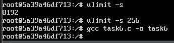

Після досягнення ліміту отримуємо `Segmentation fault (core dumped)`

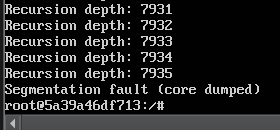
