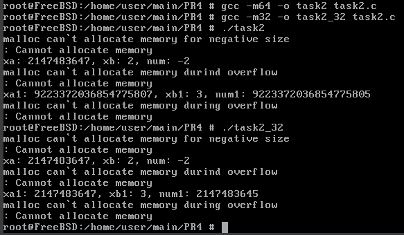
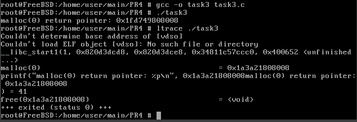
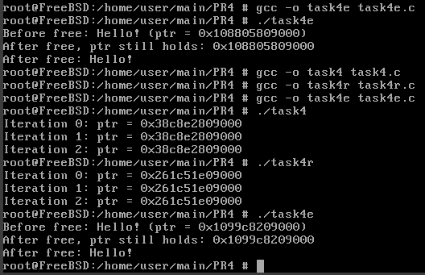
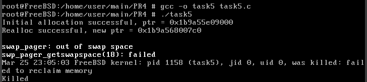
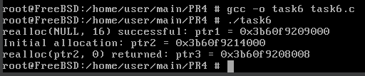
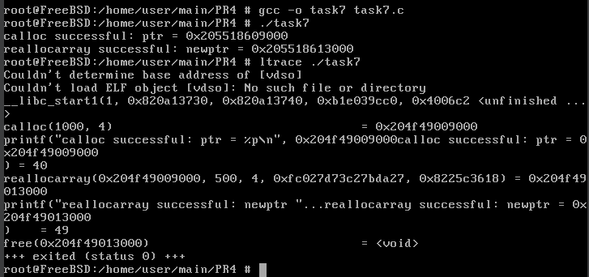

# ЗАВДАННЯ 1:

## Умова:

Скільки пам’яті може виділити malloc(3) за один виклик? Параметр malloc(3) є цілим числом типу даних size_t, тому логічно максимальне число, яке можна передати як параметр malloc(3), — це максимальне значення size_t на платформі (sizeof(size_t)). У 64-бітній Linux size_t становить 8 байтів, тобто 8 * 8 = 64 біти. Відповідно, максимальний обсяг пам’яті, який може бути виділений за один виклик malloc(3), дорівнює 2^64. Спробуйте запустити код на x86_64 та x86. Чому теоретично максимальний обсяг складає 8 ексабайт, а не 16?

## Код задачі:
```c
#include <stdio.h>
#include <stdlib.h>
#include <stdint.h>

int main() {
  printf ("Size of size_t: %zu bytes\n", sizeof (size_t));

  size_t max_size = (size_t) - 1;
  printf ("Max size, which can be transfer to malloc: %zu bytes (%.2f GB)\n", max_size, (double) max_size / (1024.0 * 1024.0 * 1024.0));

  void *ptr = malloc(max_size);
  if (ptr == NULL) {
    perror ("malloc can't allocated mamory");
  } else {
    printf ("malloc succesfully allocated memory\n");
    free(ptr);
  }
  return 0;
}
```

## Пояснення програми:


## Результат роботи:


# ЗАВДАННЯ 2:

## Умова:

Скільки пам’яті може виділити malloc(3) за один виклик? Параметр malloc(3) є цілим числом типу даних size_t, тому логічно максимальне число, яке можна передати як параметр malloc(3), — це максимальне значення size_t на платформі (sizeof(size_t)). У 64-бітній Linux size_t становить 8 байтів, тобто 8 * 8 = 64 біти. Відповідно, максимальний обсяг пам’яті, який може бути виділений за один виклик malloc(3), дорівнює 2^64. Спробуйте запустити код на x86_64 та x86. Чому теоретично максимальний обсяг складає 8 ексабайт, а не 16?

## Код задачі:

```c
#include <stdio.h>
#include <stdlib.h>
#include <limits.h>
#include <stdint.h>

int main() {
  int x = -1;
  void *neg_ptr = malloc(x) ;
  if (neg_ptr == NULL) {
    perror ("malloc can't allocate memory for negative size\n");
  } else {
    printf ("malloc succesfully allocate memory for negative size\n");
    free(neg_ptr);
  }

  int xa = INT_MAX;
  int xb = 2;
  int num = xa * xb;
  printf ("xa: %d, xb: %d, num: %d\n", xa, xb, num) ;

  void *overf low_ptr = malloc (num);
  if (overf low_ptr == NULL) {
    perror ("malloc can't allocate memory durind overf low\n");
  } else {
    printf ("malloc succesfully allocate memory during overf low\n");
    free(overflow_ptr);
  }

  size_t xa1 = SIZE_MAX / 2;
  size_t xb1 = 3;
  size_t num1 = xa1 * xb1;
  printf ("xa1: %zu, xb1: %zu, num1: %zu\n", xa1, xb1, num1) ;

  void *overflow_ptr1 = malloc (num1);
  if (overf low_ptr1 == NULL) {
    perror ("malloc can't allocate memory during overflow\n");
  } else {
    printf ("malloc succesfully allocate memory during overf low\n");
    free(overf low_ptr1);
  }

  return 0;
}
```
## Пояснення програми:


## Результат роботи:




# ЗАВДАННЯ 3:

## Умова:

Скільки пам’яті може виділити malloc(3) за один виклик? Параметр malloc(3) є цілим числом типу даних size_t, тому логічно максимальне число, яке можна передати як параметр malloc(3), — це максимальне значення size_t на платформі (sizeof(size_t)). У 64-бітній Linux size_t становить 8 байтів, тобто 8 * 8 = 64 біти. Відповідно, максимальний обсяг пам’яті, який може бути виділений за один виклик malloc(3), дорівнює 2^64. Спробуйте запустити код на x86_64 та x86. Чому теоретично максимальний обсяг складає 8 ексабайт, а не 16?

## Код задачі:

```c
#include <stdio.h>
#include <stdlib.h>

int main() {
  void *ptr = malloc (0);

  if (ptr == NULL) {
    printf ("malloc(0) return NULL\n");
  } else {
    printf ("malloc(0) return pointer: %p\n", ptr);
    free(ptr);
  }

  return 0;
}
```

## Пояснення програми:


## Результат роботи:




# ЗАВДАННЯ 4:

## Умова:

Скільки пам’яті може виділити malloc(3) за один виклик? Параметр malloc(3) є цілим числом типу даних size_t, тому логічно максимальне число, яке можна передати як параметр malloc(3), — це максимальне значення size_t на платформі (sizeof(size_t)). У 64-бітній Linux size_t становить 8 байтів, тобто 8 * 8 = 64 біти. Відповідно, максимальний обсяг пам’яті, який може бути виділений за один виклик malloc(3), дорівнює 2^64. Спробуйте запустити код на x86_64 та x86. Чому теоретично максимальний обсяг складає 8 ексабайт, а не 16?

## Код задачі:

```c
#include <stdio.h>
#include <stdlib.h>

int main() {
  void *ptr = NULL;
  for (int i = 0; i < 3; i++) {
    if (!ptr)
      ptr = malloc (10);
    if (!ptr) {
      perror ("malloc failed");
      return 1;
    }

    printf ("Iteration %d: ptr = %p\n", i, ptr);
    free(ptr);
  }
  return 0;
}
```

4e
```c
#include <stdio.h>
#include <stdlib.h>
#include <string .h>

int main() {
  void *ptr = malloc(16);
  if (!ptr) {
    perror ("malloc failed");
    return 1;
  }

  strcpy(ptr, "Hello!");
  printf ("Before free: %s (ptr = %p)\n", (char *)ptr, ptr);

  free(ptr);

  printf ("After free, ptr still holds: %p\n", ptr);
  printf ("After free: %s\n", (char *)ptr);

  return 0;
}
```

4r
```c
#include <stdio.h>
#include <stdlib.h>

int main() {
  void *ptr = NULL;
  for (int i = 0; i < 3; i++) {
    if (!ptr)
      ptr = malloc(10);
    if (!ptr) {
      perror ("malloc failed");
      return 1;
    }

    printf ("Iteration %d: ptr = %p\n", i, ptr);
    free(ptr);
    ptr = NULL;
  }

  return 0;
}
```

## Пояснення програми:


## Результат роботи:




# ЗАВДАННЯ 5:

## Умова:

Скільки пам’яті може виділити malloc(3) за один виклик? Параметр malloc(3) є цілим числом типу даних size_t, тому логічно максимальне число, яке можна передати як параметр malloc(3), — це максимальне значення size_t на платформі (sizeof(size_t)). У 64-бітній Linux size_t становить 8 байтів, тобто 8 * 8 = 64 біти. Відповідно, максимальний обсяг пам’яті, який може бути виділений за один виклик malloc(3), дорівнює 2^64. Спробуйте запустити код на x86_64 та x86. Чому теоретично максимальний обсяг складає 8 ексабайт, а не 16?

## Код задачі:

```c
#include <stdio.h>
#include <stdlib.h>
#include <string.h>

int main() {
  size_t big_size = 1024L * 1024L * 1024L * 1024L;
  void *ptr = malloc(1024);

  if (!ptr) {
    perror ("Initial malloc failed");
    return 1;
  }

  printf ("Initial allocation successful, ptr = %p\n", ptr);

  void *new_ptr = realloc(ptr, big_size);

  if (!new_ptr) {
    perror ("realloc failed");
    printf ("ptr is still valid: %p\n", ptr);
  } else {
    ptr = new_ptr;
    printf ("Realloc successful, new ptr = %p\n", ptr);

    memset (ptr, 0, big_size);
    printf ("Memory initialized successfully\n");
  }

  free(ptr);
  return 0;
}
```

## Пояснення програми:


## Результат роботи:




# ЗАВДАННЯ 6:

## Умова:

Скільки пам’яті може виділити malloc(3) за один виклик? Параметр malloc(3) є цілим числом типу даних size_t, тому логічно максимальне число, яке можна передати як параметр malloc(3), — це максимальне значення size_t на платформі (sizeof(size_t)). У 64-бітній Linux size_t становить 8 байтів, тобто 8 * 8 = 64 біти. Відповідно, максимальний обсяг пам’яті, який може бути виділений за один виклик malloc(3), дорівнює 2^64. Спробуйте запустити код на x86_64 та x86. Чому теоретично максимальний обсяг складає 8 ексабайт, а не 16?

## Код задачі:

```c
#include <stdio.h>
#include <stdlib.h>

int main() {
  void *ptr1 = realloc (NULL, 16);
  if (ptr1) {
    printf ("realloc (NULL, 16) successful: ptr1 = %p\n", ptr1);
  } else {
    printf ("realloc (NULL, 16) failed\n");
  }

  void *ptr2 = malloc(32);
  if (!ptr2) {
    perror ("malloc failde");
    return 1;
  }

  printf ("Initial allocation: ptr2 = %p\n", ptr2);

  void *ptr3 = realloc(ptr2, 0);
  printf ("realloc(ptr2, 0) returned: ptr3 = %p\n", ptr3) ;

  if (ptr3) {
    free(ptr3);
  }

  return 0;
}
```

## Пояснення програми:


## Результат роботи:




# ЗАВДАННЯ 7:

## Умова:

Скільки пам’яті може виділити malloc(3) за один виклик? Параметр malloc(3) є цілим числом типу даних size_t, тому логічно максимальне число, яке можна передати як параметр malloc(3), — це максимальне значення size_t на платформі (sizeof(size_t)). У 64-бітній Linux size_t становить 8 байтів, тобто 8 * 8 = 64 біти. Відповідно, максимальний обсяг пам’яті, який може бути виділений за один виклик malloc(3), дорівнює 2^64. Спробуйте запустити код на x86_64 та x86. Чому теоретично максимальний обсяг складає 8 ексабайт, а не 16?

## Код задачі:

```c
#include <stdio.h>
#include <stdlib.h>

struct sbar {
  int data;
}

int main() {
  struct sbar *ptr, *newptr;

  ptr = calloc(1000, sizeof (struct sbar));
  if (!ptr) {
    perror ("calloc failed");
    return 1;
  }

  printf ("calloc successful: ptr = %p\n", ptr);

  newptr = reallocarray (ptr, 500, sizeof (struct sbar));
  if (!newptr) {
    perror ("reallocarray failed");
    free (ptr);
    return 1;
  }

  printf ("reallocarray successful: newptr = %p\n", newptr);

  free (newptr);
  return 0;
}
```

## Пояснення програми:


## Результат роботи:




# ЗАВДАННЯ 8:

## Умова:

Скільки пам’яті може виділити malloc(3) за один виклик? Параметр malloc(3) є цілим числом типу даних size_t, тому логічно максимальне число, яке можна передати як параметр malloc(3), — це максимальне значення size_t на платформі (sizeof(size_t)). У 64-бітній Linux size_t становить 8 байтів, тобто 8 * 8 = 64 біти. Відповідно, максимальний обсяг пам’яті, який може бути виділений за один виклик malloc(3), дорівнює 2^64. Спробуйте запустити код на x86_64 та x86. Чому теоретично максимальний обсяг складає 8 ексабайт, а не 16?

## Код задачі:

```c
#include <stdio.h>
#include <stdlib.h>
#include <time. h>

#def ine SIZE 8192
#def ine REPEATS 10

double measure_row_access (int arr [SIZE][SIZE]) {
  clock_t start = clock();
  volatile int sum = 0;

  for (int r = 0; r < REPEATS; r++) {
    for (int i = 0; i < SIZE; i++) {
      for (int j = 0; j < SIZE; j++) {
        sum += arr[i][j];
      }
    }
  }
  return (double) (clock() - start) / CLOCKS_PER_SEC;
}

double measure_col_access (int arr[SIZE][SIZE]) {
  clock_t start = clock();
  volatile int sum = 0;

  for (int r = 0; r < REPEATS; r++) {
    for (int j = 0: j < SIZE; j++) {
      for (int i = 0; i < SIZE; i++) {
        sum += arr[i][j];
      }
    }
  }
  return (double) (clock() - start) / CLOCKS_PER_SEC;
}

int main() {
  int (*arr ) [SIZE] = malloc (SIZE * SIZE * sizeof (int));
  if (!arr) {
    perror ("Memory allocation failed");
    return 1;
  }

  for (int i = 0; i < SIZE; i++)
    for (int j = 0: j < SIZE; j++)
      arr[i][j] = i + j;

  double row_time = measure_row_access (arr);
  double col_time = measure_col_access (arr);

  printf ("Row-wise access time: %f seconds\n", row_time);
  printf ("Column-wise access time: %f seconds\n", col_time);

  free (arr);
  return 0;
}
```

## Пояснення програми:


## Результат роботи:


