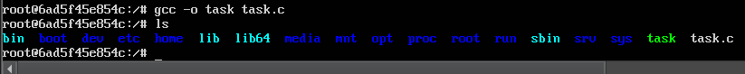
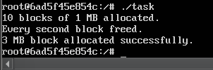
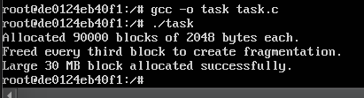

# Завдання (7 варіант)

## Умова

Створіть випадок, коли фрагментація heap-пам’яті стає причиною відмови виділення нового блоку, навіть якщо загалом пам’яті ще вистачає.

## Виконання

### [Код програми](task_files/task_1.c) 

### [Модифікований код програми](task_files/task_2.c) 

### Пояснення

У наведених програмах демонструється спроба змоделювати ситуацію, коли фрагментація heap-пам’яті заважає виділенню великого блоку пам’яті, навіть якщо загальний обсяг вільної пам’яті є достатнім. Проте обидві програми не призводять до помилки виділення великого блоку.

У першій програмі виділяється 10 блоків по 1 МБ. Потім звільняється кожен другий блок, тобто створюється фрагментована картина з вільними ділянками по 1 МБ, розділеними зайнятими. Далі програма намагається виділити один суцільний блок у 3 МБ. Теоретично, цей блок не може бути розміщений у жодному з уже звільнених фрагментів, оскільки жоден із них не має достатнього розміру. Однак програма успішно виділяє цей блок. Причина в тому, що в реалізаціях `malloc`, зокрема в `glibc`, яка використовується у Linux, якщо не вдається знайти відповідну ділянку у вже наявному `heap`, викликається `sbrk()` або `mmap()`, щоб отримати додаткову пам’ять від операційної системи. Отже, навіть якщо heap фрагментований, алокатор не обмежується лише ним і може розширити пам’ять, отримуючи суцільний блок з нової області.

У другій програмі виділяється 90 000 блоків по 2 КБ, що дає близько 180 МБ загальної пам’яті. Потім звільняється кожен третій блок, утворюючи ще вищий рівень фрагментації. Після цього пробується виділити великий блок у 30 МБ. Знову ж таки, теоретично цей блок не поміститься в жодну з існуючих фрагментованих ділянок, але програма успішно його виділяє. Як і в попередньому випадку, `malloc` використовує `mmap()` для виділення великих блоків і обходить фрагментований heap, беручи нову пам’ять напряму з операційної системи.

Таким чином, обидві програми не демонструють помилки алокації, бо сучасні системи управління пам’яттю працюють не тільки в межах heap, а й використовують механізми динамічного розширення пам’яті.

### Результат запуску програми

Компіляція та запуск початкової програми.

Компіляція та запуск модифікованої програми.
