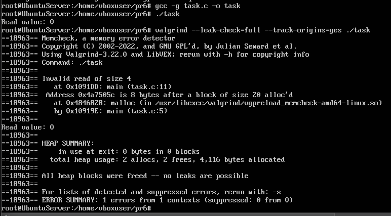
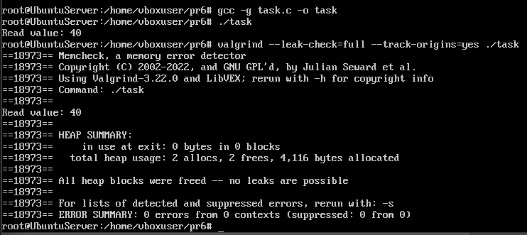

# Завдання (7 варіант)

## Умова

Test Case #6: реалізуйте переповнення при читанні в динамічному масиві (malloc).

## Виконання

### [Код програми](task_files/task_1.c) 

### [Модифікований код програми](task_files/task_2.c) 

### Пояснення

У наведених програмах показано два варіанти роботи з динамічно виділеним масивом через `malloc`. У першій версії програми виділяється масив на 5 цілих чисел (тобто 5 * sizeof(int) байт). Далі масив заповнюється значеннями від 0 до 40 з кроком 10. Проблема виникає в тому, що відбувається звернення до елемента `arr[7]`, який знаходиться за межами виділеної пам’яті. Це є прикладом переповнення при читанні (`out-of-bounds read`), оскільки допустимими індексами для такого масиву є тільки `arr[0]` до `arr[4]`. Звернення до `arr[7]` порушує межі, але в момент виконання програма не падає, а просто виводить значення 0. Це відбувається тому, що за цією адресою опинилася доступна пам’ять, яка не викликала аварії. Саме для таких ситуацій використовується інструмент `Valgrind`. Він зафіксував `“Invalid read of size 4”` — це означає, що програма прочитала 4 байти (один int) за межами виділеного блоку. `Valgrind` також вказав, що адреса читання знаходиться на 8 байт за кінцем алокованого масиву. У другій версії програми усунуто помилку. Зчитується значення `arr[4]`, тобто останній коректний елемент масиву. Значення 40 виводиться правильно, і `Valgrind` не фіксує жодних помилок.

### Результат запуску програми

Компіляція та запуск початкової програми.

Компіляція та запуск модифікованої програми.
