# Завдання 1

## Умова

Використайте popen(), щоб передати вивід команди rwho (команда UNIX) до more (команда UNIX) у програмі на C.

## Виконання

### [Код програми](task1/task1.c) 

### Пояснення

Ця програма демонструє, як за допомогою функції `popen()` з’єднати дві UNIX-команди — `rwho` і `more` — подібно до того, як це працює в конвеєрі `rwho | more` в командному рядку. Програма відкриває два потоки: перший — для читання виводу команди `rwho`, яка показує список користувачів, що зараз увійшли до системи; другий — для запису у вхідний потік команди `more`, яка виводить текст порціями, зручно для перегляду довгих списків. За допомогою циклу `while` програма читає рядки з виводу `rwho` у буфер і відразу передає їх у `more` через `fputs`. Наприкінці обидва потоки закриваються через `pclose()`.  

### Результат запуску програми

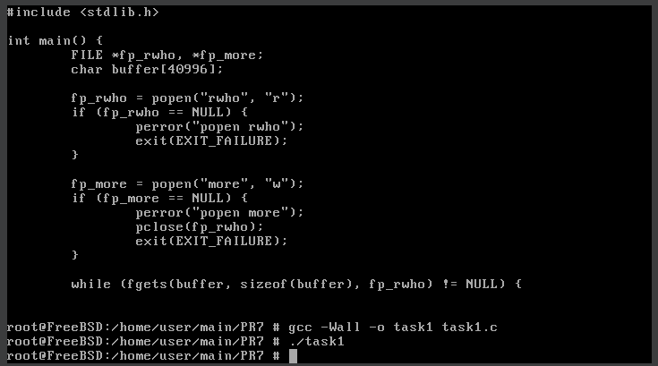

# Завдання 2

## Умова

Напишіть програму мовою C, яка імітує команду ls -l в UNIX — виводить список усіх файлів у поточному каталозі та перелічує права доступу тощо. (Варіант вирішення, що просто виконує ls -l із вашої програми, — не підходить.)

## Виконання

### [Код програми](task2/task2.c) 

### Пояснення

Ця програма імітує команду `ls -l` у UNIX без виклику зовнішньої команди, тобто самостійно збирає та виводить всю необхідну інформацію про файли в поточному каталозі. Вона відкриває поточний каталог за допомогою функції `opendir(".")`, далі за допомогою `readdir()` читає кожен файл або підкаталог. Пропускаються стандартні записи `"."` та `".."`. Для кожного об'єкта викликається `lstat()`, щоб отримати його характеристики: тип, права доступу, кількість жорстких посилань, ідентифікатори власника та групи, розмір, час останньої модифікації. Функція `print_mode()` будує рядок прав доступу, подібний до формату `-rwxr-xr--`, де перший символ показує тип об'єкта (наприклад, `d` — директорія, `-` — звичайний файл, `l` — символьне посилання), а решта — права користувача, групи та інших. Імена користувача та групи визначаються за допомогою `getpwuid()` та `getgrgid()`. Розмір файлу виводиться у байтах, час модифікації форматовано за допомогою `strftime()` у вигляді місяць день година:хвилина. Нарешті, виводиться ім’я об’єкта, а якщо це символьне посилання — додатково показується шлях, на який воно вказує, використовуючи `readlink()`. Усе це разом створює вивід, максимально схожий на стандартний `ls -l`.  

### Результат запуску програми

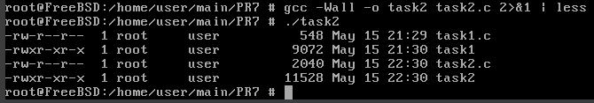

# Завдання 3

## Умова

Напишіть програму, яка друкує рядки з файлу, що містять слово, передане як аргумент програми (проста версія утиліти grep в UNIX).

## Виконання

### [Код програми](task3/task3.c) 

### Пояснення

Ця програма є спрощеною версією команди `grep` в UNIX. Вона приймає два аргументи з командного рядка: перший — це слово, яке потрібно знайти, а другий — назва файлу, в якому шукати. Спочатку програма перевіряє, чи передано саме два аргументи (не враховуючи імені самої програми). Якщо ні — виводиться повідомлення про правильний формат виклику програми, і вона завершується з кодом помилки. Далі програма відкриває файл для читання. Якщо файл не вдається відкрити (наприклад, через його відсутність або відсутність прав доступу), виводиться повідомлення про помилку, і програма завершується. Якщо файл відкрито успішно, програма читає його по рядкам. Для кожного рядка виконується перевірка: якщо цей рядок містить передане слово (за допомогою функції `strstr()`), рядок виводиться на екран. Врешті, файл закривається, і програма завершує роботу. Такий підхід дозволяє ефективно знаходити інформацію у великих текстових файлах без зайвих обчислень. 

### Текстовий файл

### Результат запуску програми

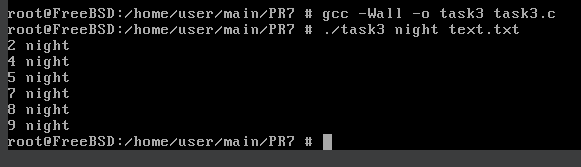

# Завдання 4

## Умова

Напишіть програму, яка виводить список файлів, заданих у вигляді аргументів, з зупинкою кожні 20 рядків, доки не буде натиснута клавіша (спрощена версія утиліти more в UNIX).

## Виконання

### [Код програми](task4/task4.c) 

### Пояснення

Ця програма є спрощеною версією утиліти `more`, яка використовується для посторінкового перегляду вмісту текстових файлів. Вона виводить вміст одного або кількох файлів, і після кожних 20 рядків призупиняє вивід, очікуючи натискання клавіші `Enter`, перш ніж продовжити показ наступної "сторінки".

У функції `main` спочатку перевіряється, чи передано принаймні один аргумент командного рядка (тобто назву файлу). Якщо жодного файлу не передано, програма повідомляє про правильний формат запуску і завершується з кодом помилки.

Далі за допомогою циклу програма проходить по всіх переданих аргументах (файлах), і для кожного викликає функцію `show_file`. Перед виведенням вмісту кожного файлу виводиться заголовок з назвою файлу, щоб користувач міг зорієнтуватися, з якого саме файлу йде вивід.

Функція `show_file` відкриває файл у режимі читання. Якщо файл не вдається відкрити (наприклад, якщо його не існує), виводиться повідомлення про помилку за допомогою `perror`, після чого функція повертається.

Читання з файлу відбувається пострічково за допомогою `fgets`. Кожен зчитаний рядок одразу виводиться на екран за допомогою `fputs`. Лічильник `line_count` рахує кількість уже виведених рядків. Коли він досягає значення 20 (визначеного макросом `LINES_PER_PAGE`), програма призупиняє вивід і виводить запрошення: `== Press Enter for continue ==`. Після натискання `Enter` (обробленого через `getchar()` у циклі) лічильник рядків обнуляється, і вивід продовжується з наступної сторінки.

Після завершення читання всього файлу він закривається за допомогою `fclose`.

Таким чином, ця програма зручно виводить довгі файли, не заповнюючи одразу увесь екран текстом, і дозволяє користувачеві поступово переглядати вміст, натискаючи `Enter` для переходу до наступної частини.

### Результат запуску програми

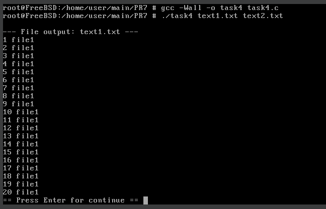

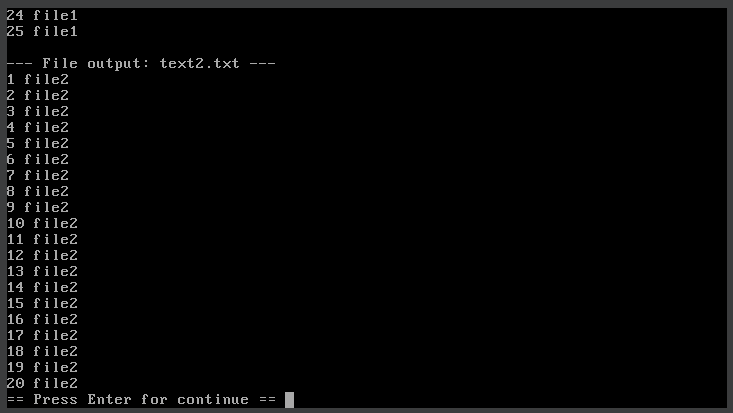

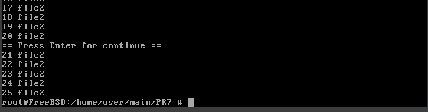

# Завдання 5

## Умова

Напишіть програму, яка перелічує всі файли в поточному каталозі та всі файли в підкаталогах.

## Виконання

### [Код програми](task5/task5.c) 

### Пояснення

Ця програма призначена для рекурсивного переліку всіх файлів у поточному каталозі та всіх його підкаталогах. Вона працює аналогічно до команди `find . -type f`, виводячи повні шляхи до всіх файлів, які містяться у вказаній директорії та її вкладених каталогах.

У функції `main` викликається функція `list_directory`, передаючи їй `"."` — позначення поточного каталогу. Це означає, що перелік починається з директорії, в якій була запущена програма.

Функція `list_directory` відкриває каталог за допомогою `opendir`. Якщо каталог не вдалося відкрити (наприклад, через відсутність дозволів), виводиться повідомлення про помилку з поясненням, отриманим через `strerror(errno)`.

Після успішного відкриття каталогу програма виводить назву поточної директорії, а далі починає читати всі записи в каталозі у циклі з використанням `readdir`. Кожен запис — це структура `dirent`, яка містить, зокрема, ім’я файлу або підкаталогу.

Записи `"."` та `".."` (поточна і батьківська директорії) пропускаються, щоб уникнути нескінченної рекурсії.

Для кожного іншого запису будується повний шлях до елемента, використовуючи `snprintf`, який поєднує шлях поточної директорії та назву запису.

Далі за допомогою функції `stat` отримується інформація про файл або каталог. Якщо `stat` завершується з помилкою, виводиться повідомлення про помилку, і обробка переходить до наступного елемента.

Якщо виявлено, що цей елемент є директорією (перевіряється через `S_ISDIR(st.st_mode)`), функція `list_directory` викликається рекурсивно для цього підкаталогу. Інакше (тобто якщо це звичайний файл), виводиться повний шлях до файлу.

Після обробки всіх записів директорія закривається за допомогою `closedir`.

Таким чином, програма повністю обходить файлову ієрархію, починаючи з поточного каталогу, і виводить шляхи до всіх знайдених файлів. Рекурсія забезпечує обхід будь-якої глибини вкладених підкаталогів.  

### Результат запуску програми

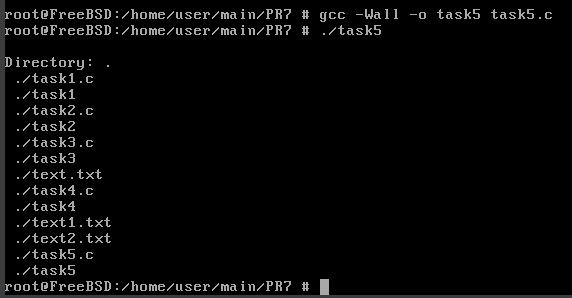

# Завдання 6

## Умова

Напишіть програму, яка перелічує лише підкаталоги у алфавітному порядку.

## Виконання

### [Код програми](task6/task6.c) 

### Пояснення

Ця програма призначена для того, щоб вивести список усіх підкаталогів у поточному каталозі в алфавітному порядку. Вона починає свою роботу з відкриття поточної директорії за допомогою функції `opendir`. Якщо каталог не вдається відкрити (наприклад, через відсутність дозволу), програма виводить повідомлення про помилку і завершується. Далі програма послідовно читає всі записи в каталозі за допомогою `readdir`. Записи з іменами `"."` та `".."` (які відповідають поточному та батьківському каталогу) пропускаються, щоб уникнути зациклення.

Для кожного іншого запису програма формує повний шлях, поєднуючи поточний каталог `"./"` з іменем знайденого елемента. Далі за допомогою функції `stat` вона перевіряє, чи є цей об’єкт підкаталогом. Якщо так, його ім’я додається до динамічного масиву рядків. На початку для зберігання імен каталогів виділяється пам’ять на фіксовану кількість елементів, і якщо масив заповнюється, він автоматично розширюється вдвічі за допомогою `realloc`. Кожне ім’я зберігається окремо за допомогою функції `strdup`, яка створює копію рядка.

Після завершення читання каталогу всі зібрані імена каталогів сортуються у алфавітному порядку за допомогою стандартної функції `qsort`, яка використовує для порівняння допоміжну функцію, що викликає `strcmp`. Після сортування програма виводить кожне ім’я каталогу з символом / наприкінці, щоб чітко позначити, що це саме каталог. Нарешті, пам’ять, яку було виділено під масив імен, а також під кожен окремий рядок, звільняється.

Таким чином, програма акуратно, ефективно і безпечним способом формує список підкаталогів у поточній директорії та виводить його в зрозумілому і впорядкованому вигляді.  

### Результат запуску програми

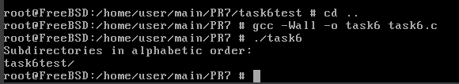

# Завдання 7

## Умова

Напишіть програму, яка показує користувачу всі його/її вихідні програми на C, а потім в інтерактивному режимі запитує, чи потрібно надати іншим дозвіл на читання (read permission); у разі ствердної відповіді — такий дозвіл повинен бути наданий.

## Виконання

### [Код програми](task7/task7.c) 

### Пояснення

Ця програма призначена для пошуку у поточному каталозі всіх виконуваних файлів, що належать поточному користувачу. Після знаходження кожного такого файлу програма виводить його ім’я і запитує користувача, чи потрібно надати іншим користувачам дозвіл на читання цього файлу. Якщо користувач підтверджує (відповідає `«y»` або `«Y`»), програма змінює права доступу до файлу, додаючи дозвіл на читання для інших (`others`). В іншому випадку вона пропускає цей файл.

Починається виконання програми з відкриття поточного каталогу за допомогою `opendir`. Якщо каталог не вдалося відкрити, виводиться повідомлення про помилку і програма завершується. Потім у циклі за допомогою `readdir` зчитуються всі записи каталогу. Записи `"."` і `".."`, які відповідають поточному та батьківському каталогу, пропускаються.

Для кожного іншого запису виконується перевірка за допомогою функції `is_executable_owned`. Ця функція виконує системний виклик `stat`, щоб отримати інформацію про файл: чи він є звичайним файлом, чи встановлено для нього право виконання власником, і чи належить файл поточному користувачу (перевіряється зіставлення власника файлу та ідентифікатора користувача, що запустив програму). Якщо всі ці умови виконуються, файл вважається виконуваною програмою власника.

Для кожного такого файлу виконується функція `process_file`, яка знову виконує `stat` для отримання поточних прав доступу. Потім програма виводить запит користувачу з проханням підтвердити, чи хоче він надати іншим користувачам дозвіл на читання цього файлу. Якщо користувач вводить `«y»` або `«Y»`, права доступу змінюються за допомогою функції `chmod`: до існуючих прав додається біт `S_IROTH`, що означає дозвіл на читання для інших користувачів. Якщо операція успішна, виводиться повідомлення про успішне надання дозволу. Якщо користувач відповідає інакше або не вводить нічого, файл пропускається.

Після обробки всіх файлів відкритий каталог закривається, і програма завершує роботу.

Отже, ця програма автоматизує перевірку виконуваних файлів власника у поточному каталозі та дозволяє у інтерактивному режимі швидко надати іншим користувачам дозвіл на їх читання, що може бути корисно, наприклад, для спільного доступу до власних програм.  

### Результат запуску програми

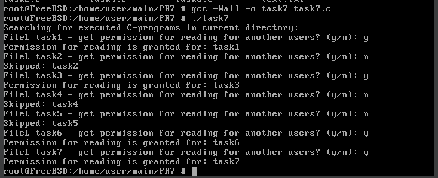

# Завдання 8

## Умова

Напишіть програму, яка надає користувачу можливість видалити будь-який або всі файли у поточному робочому каталозі. Має з’являтися ім’я файлу з запитом, чи слід його видалити.

## Виконання

### [Код програми](task8/task8.c) 

### Пояснення

Ця програма надає користувачу можливість вибірково видаляти файли у поточному робочому каталозі. Спочатку програма відкриває поточний каталог за допомогою функції `opendir`. Якщо відкрити каталог не вдається, виводиться повідомлення про помилку, і програма завершує роботу.

Далі в циклі послідовно читаються всі записи каталогу за допомогою `readdir`. Імена записів `"."` і `".."` пропускаються, щоб уникнути небажаних операцій з поточним та батьківським каталогами. Для кожного іншого запису програма перевіряє, чи є він звичайним файлом, викликаючи функцію `is_regular_file`, яка за допомогою `stat` перевіряє тип файлу.

Якщо файл звичайний, користувачеві виводиться запит з іменем файлу і пропозицією вибрати дію: видалити файл (`y`), пропустити файл (`n`) або видалити всі файли, що залишилися (`a`). Програма зчитує відповідь користувача з консолі.

Якщо користувач вводить `y` або `Y`, файл видаляється за допомогою функції `remove`. У разі успішного видалення виводиться повідомлення про це, у разі помилки — повідомлення про помилку. Якщо користувач вводить n або іншу відповідь, файл пропускається.

Якщо користувач вводить `a` або `A` (вказуючи бажання видалити всі файли, що залишилися), програма починає безперервно видаляти всі наступні файли, що залишилися в каталозі, не питаючи більше підтверджень. Проте у наданому коді цей блок використання опції "всі" реалізовано, але в кінцевому результаті вона не використовується, як зауважено у коментарі в кінці, оскільки така функція може бути небезпечною та призвести до випадкової втрати файлів.

Таким чином, програма інтерактивно дозволяє користувачу обирати, які файли видалити, і забезпечує безпечний спосіб контролю за процесом видалення без автоматичного ризику втрати усіх файлів у каталозі.  

### Результат запуску програми

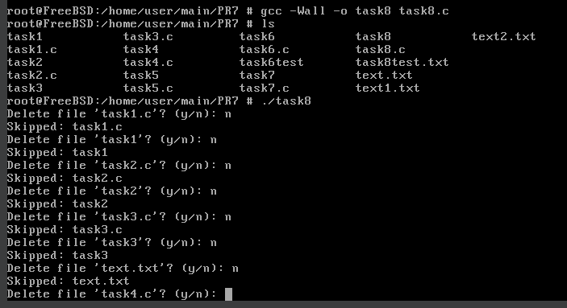

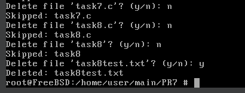

# Завдання 9

## Умова

Напишіть програму на C, яка вимірює час виконання фрагмента коду в мілісекундах.

## Виконання

### [Код програми](task9/task9.c) 

### Пояснення

Ця програма призначена для вимірювання часу виконання певного фрагмента коду у мілісекундах. Вона використовує функції `gettimeofday` для отримання точного часу до та після виконання коду.

Спершу визначається допоміжна функція `time_diff_ms`, яка приймає дві структури типу `timeval — start` та `end`. Ця функція обчислює різницю між ними в мілісекундах. Вона рахує різницю в секундах (`tv_sec`) та мікросекундах (`tv_usec`), переводить секунди у мілісекунди і додає до них мілісекунди, отримані з мікросекундної частини.

У функції `main` спочатку виконується виклик `gettimeofday(&start, NULL)`, щоб зафіксувати час початку вимірювання. Потім виконується сам фрагмент коду, час виконання якого потрібно виміряти — у цьому випадку це порожній цикл, який ітерується 100 мільйонів разів. Для того, щоб компілятор не оптимізував цей цикл і не прибрав його як непотрібний, використовується ключове слово `volatile` у змінній циклу.

Після завершення циклу викликається `gettimeofday(&end, NULL)`, щоб зафіксувати час закінчення виконання.

Нарешті, викликається функція `time_diff_ms`, яка обчислює різницю між кінцевим та початковим часом, і виводить її на екран у мілісекундах.

Отже, ця програма наочно демонструє, як виміряти тривалість виконання коду з точністю до мілісекунд, що корисно для профілювання продуктивності або оптимізації.  

### Результат запуску програми

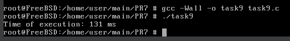

# Завдання 10

## Умова

Напишіть програму мовою C для створення послідовності випадкових чисел з плаваючою комою у діапазонах:
 (a) від 0.0 до 1.0
 (b) від 0.0 до n, де n — будь-яке дійсне число з плаваючою точкою.
Початкове значення генератора випадкових чисел має бути встановлене так, щоб гарантувати унікальну послідовність.
Примітка: використання прапорця -Wall під час компіляції є обов’язковим.

## Виконання

### [Код програми](task10/task10.c) 

### Пояснення

Ця програма генерує послідовність випадкових чисел з плаваючою крапкою у двох діапазонах: від 0.0 до 1.0 і від 0.0 до будь-якого додатнього числа `n`, яке можна передати програмі як аргумент командного рядка.

Спочатку визначено дві функції. Перша, `rand_0_1()`, повертає випадкове число з діапазону від 0.0 до 1.0. Для цього використовується стандартна функція `rand()`, яка повертає ціле випадкове число від 0 до `RAND_MAX`. Поділивши це значення на `RAND_MAX` і приведучи до типу `float`, отримуємо випадкове число з плаваючою точкою у діапазоні від 0.0 до 1.0.

Друга функція, `rand_0_n(float n)`, генерує випадкове число в діапазоні від 0.0 до `n`. Вона просто множить результат функції `rand_0_1()` на значення `n`.

У функції `main` перевіряється, чи передано аргумент командного рядка. Якщо так, він перетворюється в число з плаваючою точкою за допомогою `atof()`. Якщо значення `n` не є додатнім, виводиться повідомлення про помилку, і програма завершується з кодом невдачі.

Далі виконується ініціалізація генератора випадкових чисел викликом `srand()`, передаючи поточний час у секундах як початкове значення (`seed`). Це гарантує, що кожен запуск програми буде породжувати унікальну послідовність випадкових чисел.

Після цього виводяться п'ять випадкових чисел у діапазоні від 0.0 до 1.0 і п'ять чисел у діапазоні від 0.0 до `n` із точністю до шести знаків після коми.

Програма компілюється з прапорцем `-Wall` для увімкнення максимальної кількості попереджень компілятора, що допомагає уникати помилок і попереджень у коді.

### Результат запуску програми без параметра

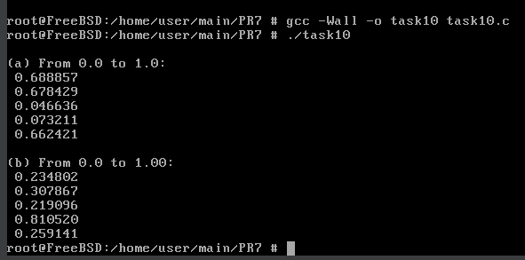

### Результат запуску програми з параметром

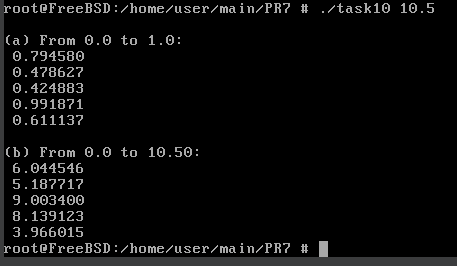

# Завдання 11 (варіант 7)

## Умова

Змоделюйте файлову систему на основі одного великого двійкового файлу з підтримкою створення, видалення та читання файлів.

## Виконання

### [Код програми](task11/task11.c) 

### Пояснення

Ця програма реалізує просту файлову систему, яка зберігає всі файли всередині одного великого двійкового файлу з назвою `"filesystem.dat"`. Вона підтримує базові операції: ініціалізацію системи, створення файлів, їх видалення та читання. Ідея полягає в тому, що весь вміст файлової системи знаходиться у одному файлі, де на початку зберігається спеціальна структура – заголовок, яка містить інформацію про всі файли, що зберігаються у системі. Ця інформація включає ім'я файлу, позицію початку його даних у файлі системи, розмір файлу та прапорець активності, який позначає, чи є файл «активним» (існує) чи видаленим.

При запуску команди ініціалізації програма створює цей файл і записує в нього порожній заголовок з нульовою кількістю файлів. При створенні нового файлу програма перевіряє, що файл з таким ім’ям ще не існує, відкриває вихідний файл з даними, зчитує його вміст та додає в кінець файлу файлової системи, запам’ятовуючи позицію початку цих даних та розмір файлу. У заголовку зберігається запис з інформацією про цей файл, і лічильник файлів збільшується. Видалення файлу відбувається за рахунок того, що його запис у заголовку позначається як неактивний — фактично дані залишаються у файлі, але при подальшому читанні цей файл ігнорується. Читання файлу здійснюється шляхом пошуку його запису в заголовку, а потім послідовним зчитуванням його даних з відповідної позиції у файлі файлової системи з виводом на екран або у вказаний файл.

Основні обмеження цієї системи полягають у тому, що вона не виконує дефрагментації і не звільняє місце після видалення файлів, а також підтримує не більше 128 файлів з іменами до 31 символу. Дані файлів зберігаються послідовно, тому розмір основного файлу лише зростає з часом. Програма є наочною демонстрацією базових принципів організації файлової системи на одному великому файлі: використання заголовка для збереження метаданих, роботу з офсетами для доступу до даних і основні операції зі створення, видалення та читання файлів. Вона підходить для освітніх цілей, щоб показати, як можна організувати просту файлову систему без складних механізмів індексації та управління простором, які є у реальних файлових системах.  

### Результат запуску програми

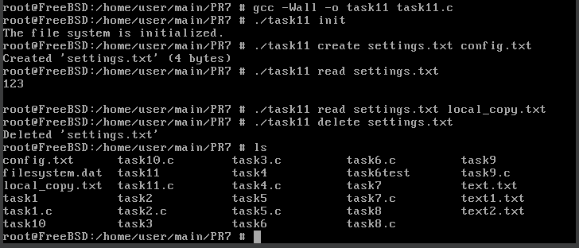
