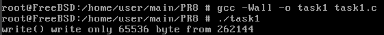
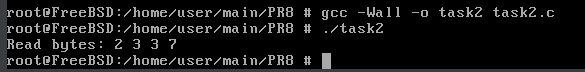
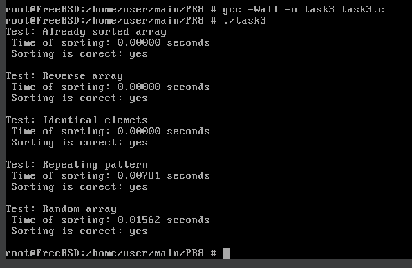
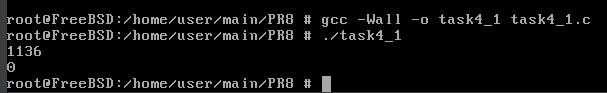
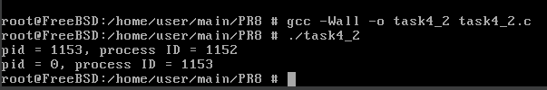

# Завдання 1

## Умова

Чи може виклик count = write(fd, buffer, nbytes); повернути в змінній count значення, відмінне від nbytes? Якщо так, то чому? Наведіть робочий приклад програми, яка демонструє вашу відповідь.

## Виконання

### [Код програми](task1/task1.c) 

### Пояснення

Так, виклик `write(fd, buffer, nbytes);` може повернути значення, менше за `nbytes`. Це відбувається тому, що функція `write` не гарантує запис усіх байтів за один виклик. Особливо це характерно для пристроїв з обмеженим буфером, таких як `pipe` або сокети, а також якщо дескриптор відкритий у неблокуючому режимі (`O_NONBLOCK`). У цьому випадку `write` записує лише ту кількість байт, яку може помістити у внутрішній буфер пристрою одразу, і повертає число фактично записаних байт. Якщо залишок даних не поміщається, `write` повертає менше, ніж `nbytes`, і програмі потрібно викликати `write` повторно, щоб записати решту даних.

У наведеній програмі створюється `pipe`, у якого записуючий дескриптор переводиться в неблокуючий режим. Після цього програма намагається записати у `pipe` великий буфер розміром 256 КБ. Оскільки внутрішній буфер `pipe` зазвичай має розмір близько 64 КБ, `write` поверне число байт, менше за 256 КБ, — тобто лише стільки, скільки помістилося у буфер. Це демонструє, що `write` може повертати значення, відмінне від `nbytes`.

Таким чином, функція `write` може записати менше даних, ніж попросили, зокрема через обмеження розміру буфера пристрою та режим неблокуючого вводу-виводу. Це нормальна і очікувана поведінка, яку потрібно враховувати при програмуванні. Програма, яку ви навели, є прикладом такої ситуації.  

### Результат запуску програми



# Завдання 2

## Умова

Є файл, дескриптор якого — fd. Файл містить таку послідовність байтів: 4, 5, 2, 2, 3, 3, 7, 9, 1, 5. У програмі виконується наступна послідовність системних викликів:
lseek(fd, 3, SEEK_SET);
read(fd, &buffer, 4);
де виклик lseek переміщує покажчик на третій байт файлу. Що буде містити буфер після завершення виклику read? Наведіть робочий приклад програми, яка демонструє вашу відповідь.

## Виконання

### [Код програми](task2/task2.c) 

### Пояснення

Файл містить послідовність байтів: 4, 5, 2, 2, 3, 3, 7, 9, 1, 5. Виклик системної функції `lseek(fd, 3, SEEK_SET)` переміщує файловий покажчик на третій байт файлу, тобто на четвертий за порядком байт, який має значення 2 (індексація починається з нуля). Далі виклик `read(fd, &buffer, 4)` зчитує чотири байти починаючи з позиції 3, отже у буфер потраплять байти з індексами 3, 4, 5 та 6 — це 2, 3, 3 і 7 відповідно. Таким чином, після завершення читання буфер міститиме значення 2, 3, 3, 7.

Для демонстрації цієї поведінки можна використати програму, яка спочатку створює файл з заданою послідовністю байтів, потім відкриває його, встановлює позицію читання на третій байт і читає чотири байти у буфер. Після цього програма виводить прочитані байти. При виконанні буде виведено рядок `"Read bytes: 2 3 3 7"`, що підтверджує описану поведінку.  

### Результат запуску програми



# Завдання 3

## Умова

Бібліотечна функція qsort призначена для сортування даних будь-якого типу. Для її роботи необхідно підготувати функцію порівняння, яка викликається з qsort кожного разу, коли потрібно порівняти два значення.
Оскільки значення можуть мати будь-який тип, у функцію порівняння передаються два вказівники типу void* на елементи, що порівнюються.

- Напишіть програму, яка досліджує, які вхідні дані є найгіршими для алгоритму швидкого сортування. Спробуйте знайти кілька масивів даних, які змушують qsort працювати якнайповільніше. Автоматизуйте процес експериментування так, щоб підбір і аналіз вхідних даних виконувалися самостійно.


- Придумайте і реалізуйте набір тестів для перевірки правильності функції qsort.


## Виконання

### [Код програми](task3/task3.c) 

### Пояснення

Функція `qsort` у стандартній бібліотеці C реалізує алгоритм швидкого сортування, який зазвичай працює за час приблизно O(n log n). Однак у найгіршому випадку, коли вибір опорного елемента неефективний (наприклад, якщо масив вже відсортований або відсортований у зворотному порядку і опорним вибирається крайній елемент), час роботи може зрости до квадратичного — O(n²). Тому, щоб дослідити найгірші вхідні дані для `qsort`, у програмі створюються різні типи масивів: впорядкований за зростанням, впорядкований у зворотному напрямку, масив із однаковими елементами, масив із циклічно повторюваним патерном та випадковий масив. Для кожного такого масиву виконується сортування за допомогою `qsort`, після чого вимірюється час роботи функції та перевіряється, чи масив дійсно відсортований. Функція `compare` порівнює два цілі числа, передані як вказівники `void*`, що є типовим підходом для універсальної функції порівняння, необхідної для `qsort`.

Під час тестування визначається, який тип вхідних даних призводить до найтривалішого часу роботи `qsort`, що фактично є найгіршим випадком. Найчастіше це буває вже відсортований масив або масив, відсортований у зворотному напрямку, залежно від реалізації функції. Масив із однаковими елементами також може бути проблемним, якщо реалізація не оптимізована на обробку таких випадків.

Автоматизація полягає у тому, що для кожного типу вхідних даних виділяється пам'ять під масив, він заповнюється відповідними значеннями, запускається сортування, фіксується час роботи, а потім перевіряється коректність сортування. Результати виводяться на екран для наочного порівняння. Завдяки цьому можна не лише виявити найгірші випадки, а й перевірити правильність роботи функції `qsort` на різних вхідних даних.

Таким чином, цей підхід дозволяє як виявити типи вхідних даних, які найгірше впливають на швидкість сортування, так і автоматично тестувати правильність роботи функції сортування у різних сценаріях, що робить програму універсальним інструментом для аналізу та перевірки функції `qsort`.

### Результат запуску програми



# Завдання 4

## Умова

Виконайте наступну програму на мові програмування С:
int main() {
  int pid;
  pid = fork();
  printf("%d\n", pid);
}
Завершіть цю програму. Припускаючи, що виклик fork() був успішним, яким може бути результат виконання цієї програми?

## Виконання

### [Початковий код програми](task4/task4_1.c) 

### [Фінальний код програми](task4/task4_2.c)

### Пояснення

Програма виконує системний виклик `fork()`, який створює новий процес – дочірній. Після виклику `fork()` у змінній `pid` зберігається значення, яке дозволяє відрізнити батьківський процес від дочірнього: у батьківському процесі `pid` містить ідентифікатор дочірнього процесу (позитивне число), у дочірньому – 0, а при помилці – від’ємне число. Програма перевіряє, чи `fork()` пройшов успішно, і виводить рядок з інформацією про `pid` та власний ідентифікатор процесу (отримується за допомогою `getpid()`). Оскільки `fork()` створює два процеси, команда `printf` виконується двічі – в батьківському і дочірньому процесах, тому у консолі з’явиться два рядки. Вони можуть виводитися у будь-якому порядку, бо процеси виконуються паралельно і порядок їх виводу залежить від планування операційної системи. У першому рядку буде pid = 0 і process ID дорівнюватиме ідентифікатору дочірнього процесу, а у другому рядку `pid` міститиме PID дочірнього процесу, а process ID – PID батьківського. Якщо виклик `fork()` не вдасться, буде виведено повідомлення про помилку. Таким чином, запуск програми виведе два рядки з інформацією про процеси, які ілюструють результат роботи `fork()` і демонструють створення дочірнього процесу.

### Результат запуску початкової програми



### Результат запуску фінальної програми



# Завдання 5 (варіант 7)

## Умова

Розробіть програму, яка ілюструє різницю між dup() та dup2() у контексті перенаправлення потоків.

## Виконання

### [Код програми](task5/task5.c) 

### Пояснення

Програма демонструє різницю між викликами `dup()` і `dup2()` у контексті перенаправлення стандартного потоку виводу `stdout`.

Спочатку відкривається файл output.txt для запису (із створенням або очищенням). За допомогою `dup(STDOUT_FILENO)` створюється копія дескриптора стандартного виводу, яка зберігається у змінній `saved_stdout`. Це потрібно, щоб потім повернути стандартний вивід назад до початкового стану.

Потім викликається `dup2(file, STDOUT_FILENO)`, який замінює дескриптор `STDOUT_FILENO` дескриптором відкритого файлу `file`. Тобто, після цього всі виводи у `stdout` перенаправляються у файл `output.txt`. Виконується `printf("Hello dup()\n");` — цей текст потрапляє у файл.

Далі викликається `dup2(saved_stdout, STDOUT_FILENO)`, який повертає стандартний вивід до початкового стану (консоль). Закривається збережений дескриптор `saved_stdout`, бо він вже не потрібен.

Далі знову відкривається файл `output.txt` у режимі додавання (`O_APPEND`), щоб наступні дані не перезаписували файл, а дописувалися в кінець. Знову виконується `dup2(file2, STDOUT_FILENO)`, що перенаправляє стандартний вивід у відкритий файл.

Після цього виконується `printf("Hello dup2()\n");`, який додає цей текст у кінець файлу.

Насамкінець, відкритий дескриптор файлу закривається, і програма завершується.

Ключова різниця:

- `dup()` створює копію дескриптора з найменшим доступним числом, повертаючи новий дескриптор. В нашому випадку він зберігає копію стандартного виводу, щоб потім його відновити.

- `dup2(oldfd, newfd)` закриває дескриптор `newfd` (якщо він відкритий) і робить його копією `oldfd`. Використовується для точного переназначення дескриптора, наприклад, перенаправлення `stdout` у потрібний файл.

Програма показує, що після `dup()` ми зберігаємо початковий дескриптор `stdout`, щоб повернути його пізніше, а `dup2()` використовується двічі для перенаправлення потоку — спочатку на файл (перезапис), потім знову на файл (дописування). При цьому ми бачимо, що `dup2()` більш гнучкий, бо можна явно вказати, який дескриптор потрібно замінити.

У результаті файл `output.tx`t міститиме обидва рядки:

```
Hello dup()
Hello dup2()
```

а в консолі нічого не виведеться, бо вивід повністю перенаправлений у файл.

### Результат запуску програми


### Файл `output.txt`


