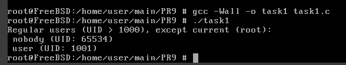
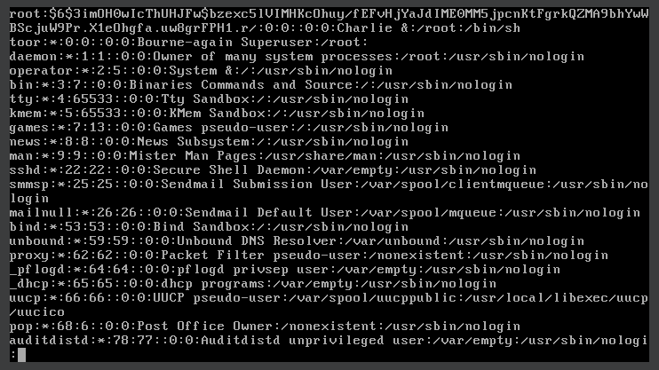
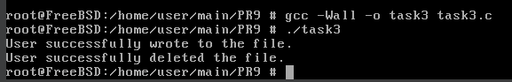
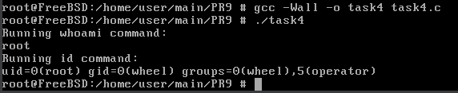
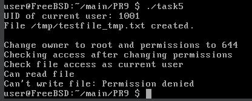
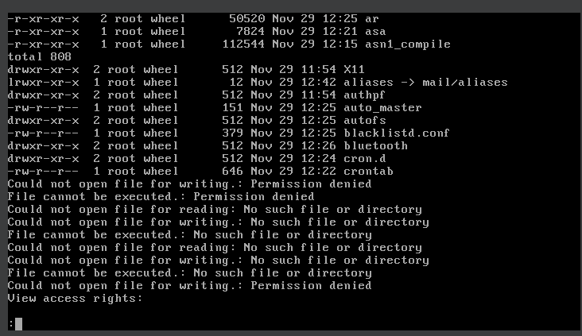
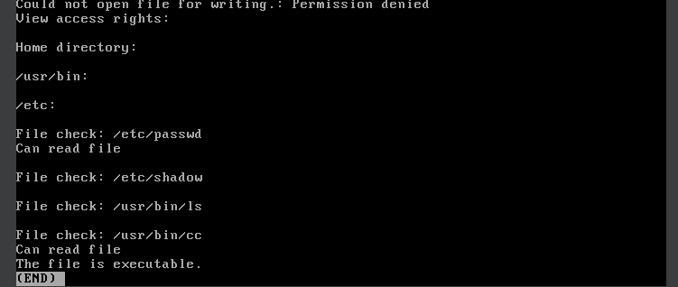
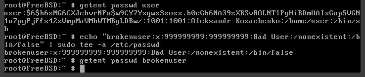

# Завдання 1

## Умова

Напишіть програму, яка читає файл /etc/passwd за допомогою команди getent passwd, щоб дізнатись, які облікові записи визначені на вашому комп’ютері.
Програма повинна визначити, чи є серед них звичайні користувачі (ідентифікатори UID повинні бути більші за 500 або 1000, залежно від вашого дистрибутива), окрім вас.

## Виконання

### [Код програми](task1/task1.c) 

### Пояснення

Ця програма призначена для того, щоб визначити звичайних користувачів, зареєстрованих у системі, за винятком поточного користувача. Вона використовує команду `getent passwd`, яка виводить список усіх користувачів, подібно до вмісту файлу `/etc/passwd`. На початку програма визначає UID поточного користувача за допомогою функції `getuid()`, після чого за цим UID отримує структуру `passwd`, що містить інформацію про користувача. Із цієї структури витягується ім’я поточного користувача, щоб пізніше виключити його зі списку. UID (User ID) є унікальним числовим ідентифікатором кожного користувача в системі, і звичайні користувачі мають UID від 1000 і вище. Далі програма отримує повний список усіх користувачів системи. Рядок розбивається на частини за роздільником : — це дозволяє виділити ім’я користувача та його UID. UID перетворюється з рядка у число, після чого програма перевіряє, чи цей UID більший або рівний 1000 та чи не збігається ім’я користувача з ім’ям поточного користувача. Якщо обидві умови виконуються, програма виводить ім’я такого користувача та його UID.

### Результат запуску програми



# Завдання 2

## Умова

Напишіть програму, яка виконує команду cat /etc/shadow від імені адміністратора, хоча запускається від звичайного користувача.
(Ваша програма повинна робити необхідне, виходячи з того, що конфігурація системи дозволяє отримувати адміністративний доступ за допомогою відповідної команди.)

## Виконання

### [Код програми](task2/task2.c) 

### Пояснення

Ця програма виконанує команду `sudo cat /etc/master.passwd`, яка виводить вміст файлу `/etc/master.passwd`. Цей файл містить розширену інформацію про користувачів, зокрема захищені паролі. Щоб мати доступ до цього файлу, зазвичай потрібні права суперкористувача, тому команда виконується через `sudo`. Програма використовує функцію `system()`, яка запускає команду в окремому процесі. Результат виконання цієї команди зберігається у змінну `ret`. Після цього програма перевіряє, чи виклик `system()` завершився з помилкою — якщо повернене значення дорівнює `-1`, виводиться повідомлення про помилку за допомогою `perror()`, і програма завершується з кодом `1`, що означає помилку. Якщо ж `system()` спрацював, але команда завершилась із ненульовим кодом повернення, програма за допомогою макросів `WIFEXITED()` та `WEXITSTATUS()` визначає, чи завершився процес нормально, і який був код виходу. Якщо команда завершилась із помилкою, виводиться повідомлення, що команда не спрацювала, можливо, через нестачу прав (Maybe need privilegies sudo.), повідомляючи користувачу, що слід перевірити, чи були надані відповідні права доступу. Для запуску цієї програми від звичайного користувача я прописував команди `user ALL=(ALL) NOPASSWD: /home/user/main/PR9/task2` та `user ALL=(ALL) NOPASSWD: /bin/cat /etc/master.passwd`  в `visudo` через rootа для коректного запуску та роботи програми.

### Результат запуску програми



# Завдання 3

## Умова

Напишіть програму, яка від імені root копіює файл, який вона перед цим створила від імені звичайного користувача. Потім вона повинна помістити копію у домашній каталог звичайного користувача.
Далі, використовуючи звичайний обліковий запис, програма намагається змінити файл і зберегти зміни. Що відбудеться?
 Після цього програма намагається видалити цей файл за допомогою команди rm. Що відбудеться?

## Виконання

### [Код програми](task3/task3.c) 

### Пояснення

Ця програма демонструє, як процес у системі з правами `root` може тимчасово змінювати ефективний UID, щоб діяти від імені іншого користувача, а потім повертати собі права `root`. Вона також показує, як створюються файли від імені різних користувачів, як виконується передача прав власності на файл, і як обмеження доступу залежать від правового контексту процесу. На початку програми задається UID користувача, якого потрібно тимчасово імітувати (UID 1001) і домашня директорія цього користувача. Далі створюється тимчасовий файл `/tmp/testfile_root.txt`, у який записується рядок `"Hello from root\n"` з правами користувача `root`. Це стандартне створення файлу з правами `root`, яке виконується без проблем, оскільки програма на цьому етапі ще має повні привілеї. Після цього відбувається зміна UID на 1001 за допомогою `seteuid()`. Таким чином, процес тимчасово діє від імені цього користувача. Під цим новим UID створюється інший файл `/tmp/testfile_user.txt`, у який записується рядок `"Hello from user\n"`. Це демонструє, що навіть якщо програма початково має права root, вона може безпечно виконувати операції від імені іншого користувача, змінюючи лише UID. Після завершення створення файлу під UID користувача, процес знову повертає собі права `root` за допомогою `seteuid(0)`. Далі програма копіює вміст створеного користувачем файлу до іншого файлу у домашній директорії користувача — шлях до нього формується через `snprintf`. Для цього відкривається файл-джерело (`/tmp/testfile_user.txt`) для читання і створюється файл-призначення `copied_file.txt` для запису в домашній директорії. Щоб новостворений файл належав користувачу, від імені якого програма щойно діяла, програма виконує `chown()` — змінює власника файлу на UID користувача. Потім UID знову змінюється на UID цього користувача, і програма намагається відкрити новий файл `copied_file.txt` для дописування. Якщо відкриття не вдається — наприклад, через недостатні права — програма виведе повідомлення про помилку. Якщо ж відкриття успішне, користувач дописує рядок `"User appended this line\n"` до файлу. Після цього програма видаляє цей файл.

### Результат запуску програми



# Завдання 4

## Умова

Напишіть програму, яка по черзі виконує команди whoami та id, щоб перевірити стан облікового запису користувача, від імені якого вона запущена.
Є ймовірність, що команда id виведе список різних груп, до яких ви належите. Програма повинна це продемонструвати.

## Виконання

### [Код програми](task4/task4.c) 

### Пояснення

Ця програма виконує дві системні команди — `whoami` та `id`, щоб показати, під яким користувачем запущено програму та які в нього ідентифікатори. Вона виводить результати кожної команди. Якщо виконання будь-якої з них не вдалося, виводиться повідомлення про помилку.

### Результат запуску програми



# Завдання 5

## Умова

Напишіть програму, яка створює тимчасовий файл від імені звичайного користувача. Потім від імені суперкористувача використовує команди chown і chmod, щоб змінити тип володіння та права доступу.
Програма повинна визначити, в яких випадках вона може виконувати читання та запис файлу, використовуючи свій обліковий запис.

## Виконання

### [Код програми](task5/task5.c) 

### Пояснення

Ця програма створює файл `/tmp/testfile_tmp.txt` із правами лише для запису й читання власника (`0600`), записує в нього текст і виводить UID поточного користувача. Потім за допомогою `sudo` змінює власника файлу на `root:wheel` і права на `644`, після чого перевіряє доступ до файлу глибше — спочатку для читання, потім для запису — використовуючи `access()`, і виводить, чи може поточний (не-root) користувач читати чи писати цей файл, вказуючи помилку через `strerror(errno)`, якщо доступ закритий. Для роботи цієї програма у `visudo` потрібно прописати `user ALL=(ALL) NOPASSWD: /usr/sbin/chown, /bin/chmod`.

### Результат запуску програми



# Завдання 6

## Умова

Напишіть програму, яка виконує команду ls -l, щоб переглянути власника і права доступу до файлів у своєму домашньому каталозі, в /usr/bin та в /etc.
Продемонструйте, як ваша програма намагається обійти різні власники та права доступу користувачів, а також здійснює спроби читання, запису та виконання цих файлів.

## Виконання

### [Код програми](task6/task6.c) 

### Пояснення

Ця програма демонструє кілька способів перевірки прав доступу для різних файлів і директорій. Спочатку в `main()` вона виводить на екран поточний список файлів у домашній теці користувача (`ls -l ~`), у `/usr/bin` та у `/etc` (по десять перших записів кожного), щоб швидко побачити типи файлів, їх власників, групи і набір прав (rwx) для кожного. Далі викликається функція `test_file_access()` для кількох ключових файлів:
– `/etc/passwd`, який доступний для читання всім і містить інформацію про користувачів;
– `/etc/shadow`, який містить захешовані паролі і доступ до нього заборонено звичайним користувачам;
– `/usr/bin/ls` і `/usr/bin/cc`, виконувані файли системи.

### Результат запуску програми





# Завдання 7

## Умова

Змоделюйте ситуацію, коли getent passwd повертає неповні або некоректні дані. Чому це може статись?

## Виконання

```
echo "brokenuser:x:999999999:999999999:Bad User:/nonexistent:/bin/false" | sudo tee -a /etc/passwd

getent passwd brokenuser
```

### Пояснення

У цьому прикладі моделюється ситуація, коли команда `getent passwd` повертає некоректні або неповні дані через внесення явно неправильного запису до системного файлу `/etc/passwd` .

### Результат запуску програми



На фото в перших радяках показано що повинна виводити команда `getent passwd`.
